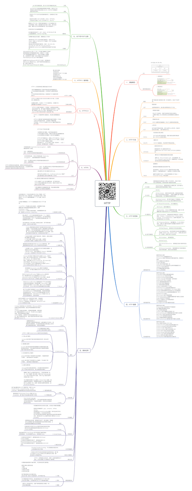

# HTTP

关注下方微信公众号，回复【思维导图】即可获得高清原图：

## 一 、基础概念

### URI

- URI 包含 URL 和 URN。

### 请求和响应报文

- 1. 请求报文
- 2. 响应报文

## 二、HTTP 方法

### 概述

- 客户端发送的 请求报文 第一行为请求行，包含了方法字段。

### GET

- 获取资源

当前网络请求中，绝大部分使用的是 GET 方法。

### HEAD

- 获取报文首部

和 GET 方法类似，但是不返回报文实体主体部分。
主要用于确认 URL 的有效性以及资源更新的日期时间等。

### POST

- 传输实体主体

POST 主要用来传输数据，而 GET 主要用来获取资源。

### PUT

- 上传文件

由于自身不带验证机制，任何人都可以上传文件，因此存在安全性问题，一般不使用该方法。

### PATCH

- 对资源进行部分修改

PUT 也可以用于修改资源，但是只能完全替代原始资源，PATCH 允许部分修改。

### DELETE

- 删除文件

与 PUT 功能相反，并且同样不带验证机制。

### OPTIONS

- 查询支持的方法

查询指定的 URL 能够支持的方法。
会返回 Allow: GET, POST, HEAD, OPTIONS 这样的内容。

### CONNECT

- 要求在与代理服务器通信时建立隧道

使用 SSL（Secure Sockets Layer，安全套接层）和 TLS（Transport Layer Security，传输层安全）协议把通信内容加密后经网络隧道传输。

### TRACE

- 追踪路径

服务器会将通信路径返回给客户端。

发送请求时，在 Max-Forwards 首部字段中填入数值，每经过一个服务器就会减 1，当数值为 0 时就停止传输。

通常不会使用 TRACE，并且它容易受到 XST 攻击（Cross-Site Tracing，跨站追踪）。

## 三、HTTP 状态码

### 概述

- 服务器返回的 响应报文 中第一行为状态行，包含了状态码以及原因短语，用来告知客户端请求的结果。

### 1XX 信息

- 100 Continue ：表明到目前为止都很正常，客户端可以继续发送请求或者忽略这个响应。

### 2XX 成功

- 200 OK
- 204 No Content ：请求已经成功处理，但是返回的响应报文不包含实体的主体部分。一般在只需要从客户端往服务器发送信息，而不需要返回数据时使用。
- 206 Partial Content ：表示客户端进行了范围请求，响应报文包含由 Content-Range 指定范围的实体内容。

### 3XX 重定向

- 301 Moved Permanently ：永久性重定向
- 302 Found ：临时性重定向
- 303 See Other ：和 302 有着相同的功能，但是 303 明确要求客户端应该采用 GET 方法获取资源。
- 304 Not Modified ：如果请求报文首部包含一些条件，例如：If-Match，If-Modified-Since，If-None-Match，If-Range，If-Unmodified-Since，如果不满足条件，则服务器会返回 304 状态码。
- 307 Temporary Redirect ：临时重定向，与 302 的含义类似，但是 307 要求浏览器不会把重定向请求的 POST 方法改成 GET 方法。

### 4XX 客户端错误

- 400 Bad Request ：请求报文中存在语法错误。
- 401 Unauthorized ：该状态码表示发送的请求需要有认证信息（BASIC 认证、DIGEST 认证）。如果之前已进行过一次请求，则表示用户认证失败。
- 403 Forbidden ：请求被拒绝。
- 404 Not Found

### 5XX 服务器错误

- 500 Internal Server Error ：服务器正在执行请求时发生错误。
- 503 Service Unavailable ：服务器暂时处于超负载或正在进行停机维护，现在无法处理请求。

## 四、HTTP 首部

### 通用首部字段

- 首部字段名	说明
	Cache-Control	控制缓存的行为
	Connection	控制不再转发给代理的首部字段、管理持久连接
	Date	创建报文的日期时间
	Pragma	报文指令
	Trailer	报文末端的首部一览
	Transfer-Encoding	指定报文主体的传输编码方式
	Upgrade	升级为其他协议
	Via	代理服务器的相关信息
	Warning	错误通知

### 请求首部字段

- 首部字段名	说明
	Accept	用户代理可处理的媒体类型
	Accept-Charset	优先的字符集
	Accept-Encoding	优先的内容编码
	Accept-Language	优先的语言（自然语言）
	Authorization	Web 认证信息
	Expect	期待服务器的特定行为
	From	用户的电子邮箱地址
	Host	请求资源所在服务器
	If-Match	比较实体标记（ETag）
	If-Modified-Since	比较资源的更新时间
	If-None-Match	比较实体标记（与 If-Match 相反）
	If-Range	资源未更新时发送实体 Byte 的范围请求
	If-Unmodified-Since	比较资源的更新时间（与 If-Modified-Since 相反）
	Max-Forwards	最大传输逐跳数
	Proxy-Authorization	代理服务器要求客户端的认证信息
	Range	实体的字节范围请求
	Referer	对请求中 URI 的原始获取方
	TE	传输编码的优先级
	User-Agent	HTTP 客户端程序的信息

### 响应首部字段

- 首部字段名	说明
	Accept-Ranges	是否接受字节范围请求
	Age	推算资源创建经过时间
	ETag	资源的匹配信息
	Location	令客户端重定向至指定 URI
	Proxy-Authenticate	代理服务器对客户端的认证信息
	Retry-After	对再次发起请求的时机要求
	Server	HTTP 服务器的安装信息
	Vary	代理服务器缓存的管理信息
	WWW-Authenticate	服务器对客户端的认证信息

### 实体首部字段

- 首部字段名	说明
	Allow	资源可支持的 HTTP 方法
	Content-Encoding	实体主体适用的编码方式
	Content-Language	实体主体的自然语言
	Content-Length	实体主体的大小
	Content-Location	替代对应资源的 URI
	Content-MD5	实体主体的报文摘要
	Content-Range	实体主体的位置范围
	Content-Type	实体主体的媒体类型
	Expires	实体主体过期的日期时间
	Last-Modified	资源的最后修改日期时间

## 五、具体应用

### 连接管理

- 1. 短连接与长连接

	- 当浏览器访问一个包含多张图片的 HTML 页面时，除了请求访问的 HTML 页面资源，还会请求图片资源。如果每进行一次 HTTP 通信就要新建一个 TCP 连接，那么开销会很大。

长连接只需要建立一次 TCP 连接就能进行多次 HTTP 通信。

1.从 HTTP/1.1 开始默认是长连接的，如果要断开连接，需要由客户端或者服务器端提出断开，使用 Connection : close；
2.在 HTTP/1.1 之前默认是短连接的，如果需要使用长连接，则使用 Connection : Keep-Alive。

- 2. 流水线

	- 默认情况下，HTTP 请求是按顺序发出的，下一个请求只有在当前请求收到响应之后才会被发出。由于受到网络延迟和带宽的限制，在下一个请求被发送到服务器之前，可能需要等待很长时间。

流水线是在同一条长连接上连续发出请求，而不用等待响应返回，这样可以减少延迟。

### Cookie

- 概述

	- Cookie 是服务器发送到用户浏览器并保存在本地的一小块数据，它会在浏览器之后向同一服务器再次发起请求时被携带上，用于告知服务端两个请求是否来自同一浏览器。由于之后每次请求都会需要携带 Cookie 数据，因此会带来额外的性能开销（尤其是在移动环境下）。

- 1. 用途

	- 1.会话状态管理（如用户登录状态、购物车、游戏分数或其它需要记录的信息）
2.个性化设置（如用户自定义设置、主题等）
3.浏览器行为跟踪（如跟踪分析用户行为等）

- 2. 创建过程

	- 服务器发送的响应报文包含 Set-Cookie 首部字段，客户端得到响应报文后把 Cookie 内容保存到浏览器中。

- 3. 分类

	- 1.会话期 Cookie：浏览器关闭之后它会被自动删除，也就是说它仅在会话期内有效。
2.持久性 Cookie：指定过期时间（Expires）或有效期（max-age）之后就成为了持久性的 Cookie。

- 4. 作用域

	- Domain 标识指定了哪些主机可以接受 Cookie。如果不指定，默认为当前文档的主机（不包含子域名）。如果指定了 Domain，则一般包含子域名。
例如，如果设置 Domain=mozilla.org，则 Cookie 也包含在子域名中（如 developer.mozilla.org）。
Path 标识指定了主机下的哪些路径可以接受 Cookie（该 URL 路径必须存在于请求 URL 中）。

- 5. JavaScript

	- 浏览器通过 document.cookie 属性可创建新的 Cookie，也可通过该属性访问非 HttpOnly 标记的 Cookie。

- 6. HttpOnly

	- 标记为 HttpOnly 的 Cookie 不能被 JavaScript 脚本调用。跨站脚本攻击 (XSS) 常常使用 JavaScript 的 document.cookie API 窃取用户的 Cookie 信息，因此使用 HttpOnly 标记可以在一定程度上避免 XSS 攻击。

- 7. Secure

	- 标记为 Secure 的 Cookie 只能通过被 HTTPS 协议加密过的请求发送给服务端。但即便设置了 Secure 标记，敏感信息也不应该通过 Cookie 传输，因为 Cookie 有其固有的不安全性，Secure 标记也无法提供确实的安全保障。

- 8. Session

	- 除了可以将用户信息通过 Cookie 存储在用户浏览器中，也可以利用 Session 存储在服务器端，存储在服务器端的信息更加安全。Session 可以存储在服务器上的文件、数据库或者内存中。也可以将 Session 存储在 Redis 这种内存型数据库中，效率会更高。

- 9. 浏览器禁用 Cookie

	- 此时无法使用 Cookie 来保存用户信息，只能使用 Session。除此之外，不能再将 Session ID 存放到 Cookie 中，而是使用 URL 重写技术，将 Session ID 作为 URL 的参数进行传递。

- 10. Cookie 与 Session 选择

	- 1.Cookie 只能存储 ASCII 码字符串，而 Session 则可以存储任何类型的数据，因此在考虑数据复杂性时首选 Session；
2.Cookie 存储在浏览器中，容易被恶意查看。如果非要将一些隐私数据存在 Cookie 中，可以将 Cookie 值进行加密，然后在服务器进行解密；
3.对于大型网站，如果用户所有的信息都存储在 Session 中，那么开销是非常大的，因此不建议将所有的用户信息都存储到 Session 中。

### 缓存

- 1. 优点

	- 1.缓解服务器压力；
2.降低客户端获取资源的延迟：缓存通常位于内存中，读取缓存的速度更快。并且缓存服务器在地理位置上也有可能比源服务器来得近，例如浏览器缓存。

- 2. 实现方法

	- 1.让代理服务器进行缓存；
2.让客户端浏览器进行缓存。

- 3. Cache-Control

	- HTTP/1.1 通过 Cache-Control 首部字段来控制缓存。
	- 3.1 禁止进行缓存

no-store 指令规定不能对请求或响应的任何一部分进行缓存。
	- 3.2 强制确认缓存

no-cache 指令规定缓存服务器需要先向源服务器验证缓存资源的有效性，只有当缓存资源有效时才能使用该缓存对客户端的请求进行响应。
	- 3.3 私有缓存和公共缓存

private 指令规定了将资源作为私有缓存，只能被单独用户使用，一般存储在用户浏览器中。

public 指令规定了将资源作为公共缓存，可以被多个用户使用，一般存储在代理服务器中。
	- 3.4 缓存过期机制

max-age 指令出现在请求报文，并且缓存资源的缓存时间小于该指令指定的时间，那么就能接受该缓存。

- 4. 缓存验证

	- 需要先了解 ETag 首部字段的含义，它是资源的唯一标识。URL 不能唯一表示资源，例如 http://www.google.com/ 有中文和英文两个资源，只有 ETag 才能对这两个资源进行唯一标识。

可以将缓存资源的 ETag 值放入 If-None-Match 首部，服务器收到该请求后，判断缓存资源的 ETag 值和资源的最新 ETag 值是否一致，如果一致则表示缓存资源有效，返回 304 Not Modified。

### 内容协商

- 1. 类型

	- 1.1 服务端驱动型

		- 客户端设置特定的 HTTP 首部字段，例如 Accept、Accept-Charset、Accept-Encoding、Accept-Language，服务器根据这些字段返回特定的资源。

	- 1.2 代理驱动型

		- 服务器返回 300 Multiple Choices 或者 406 Not Acceptable，客户端从中选出最合适的那个资源。

- 2. Vary

	- Vary: Accept-Language
在使用内容协商的情况下，只有当缓存服务器中的缓存满足内容协商条件时，才能使用该缓存，否则应该向源服务器请求该资源。

### 内容编码

- 内容编码将实体主体进行压缩，从而减少传输的数据量。

常用的内容编码有：gzip、compress、deflate、identity。
浏览器发送 Accept-Encoding 首部，其中包含有它所支持的压缩算法，以及各自的优先级。
由于该内容协商过程是基于编码类型来选择资源的展现形式的，响应报文的 Vary 首部字段至少要包含 Content-Encoding。

### 范围请求

- 概述

	- 如果网络出现中断，服务器只发送了一部分数据，范围请求可以使得客户端只请求服务器未发送的那部分数据，从而避免服务器重新发送所有数据。

- 1. Range

	- 在请求报文中添加 Range 首部字段指定请求的范围。
请求成功的话服务器返回的响应包含 206 Partial Content 状态码。

- 2. Accept-Ranges

	- 响应首部字段 Accept-Ranges 用于告知客户端是否能处理范围请求，可以处理使用 bytes，否则使用 none。

- 3. 响应状态码

	- 1.在请求成功的情况下，服务器会返回 206 Partial Content 状态码。
2.在请求的范围越界的情况下，服务器会返回 416 Requested Range Not Satisfiable 状态码。
3.在不支持范围请求的情况下，服务器会返回 200 OK 状态码。

### 分块传输编码

- Chunked Transfer Encoding，可以把数据分割成多块，让浏览器逐步显示页面。

### 多部分对象集合

- 一份报文主体内可含有多种类型的实体同时发送，每个部分之间用 boundary 字段定义的分隔符进行分隔，每个部分都可以有首部字段。

### 虚拟主机

- HTTP/1.1 使用虚拟主机技术，使得一台服务器拥有多个域名，并且在逻辑上可以看成多个服务器。

### 通信数据转发

- 1. 代理

	- 代理服务器接受客户端的请求，并且转发给其它服务器。

使用代理的主要目的是：
1.缓存
2.负载均衡
3.网络访问控制
4.访问日志记录

用户察觉得到正向代理的存在。
而反向代理一般位于内部网络中，用户察觉不到。

- 2. 网关

	- 与代理服务器不同的是，网关服务器会将 HTTP 转化为其它协议进行通信，从而请求其它非 HTTP 服务器的服务。

- 3. 隧道

	- 使用 SSL 等加密手段，在客户端和服务器之间建立一条安全的通信线路。

## 六、HTTPS

### 概述

- HTTP 有以下安全性问题：

1.使用明文进行通信，内容可能会被窃听；
2.不验证通信方的身份，通信方的身份有可能遭遇伪装；
3.无法证明报文的完整性，报文有可能遭篡改。

HTTPS 并不是新协议，而是让 HTTP 先和 SSL（Secure Sockets Layer）通信，再由 SSL 和 TCP 通信，也就是说 HTTPS 使用了隧道进行通信。
通过使用 SSL，HTTPS 具有了加密（防窃听）、认证（防伪装）和完整性保护（防篡改）。

### 加密

- 1. 对称密钥加密

	- 对称密钥加密（Symmetric-Key Encryption），加密和解密使用同一密钥。

优点：运算速度快；
缺点：无法安全地将密钥传输给通信方。

- 2.非对称密钥加密

	- 非对称密钥加密，又称公开密钥加密（Public-Key Encryption），加密和解密使用不同的密钥。

优点：可以更安全地将公开密钥传输给通信发送方；
缺点：运算速度慢。

- 优点：可以更安全地将公开密钥传输给通信发送方；
缺点：运算速度慢。

	- HTTPS 采用混合的加密机制，使用非对称密钥加密用于传输对称密钥来保证传输过程的安全性，之后使用对称密钥加密进行通信来保证通信过程的效率。

### 认证

- 通过使用 证书 来对通信方进行认证。

数字证书认证机构（CA，Certificate Authority）是客户端与服务器双方都可信赖的第三方机构。

### 完整性保护

- SSL 提供报文摘要功能来进行完整性保护。

HTTP 也提供了 MD5 报文摘要功能，但不是安全的。
HTTPS 的报文摘要功能之所以安全，是因为它结合了加密和认证这两个操作。

### HTTPS 的缺点

- 1.因为需要进行加密解密等过程，因此速度会更慢；
2.需要支付证书授权的高额费用。

## 七、HTTP/2.0

### HTTP/1.x 缺陷

- HTTP/1.x 实现简单是以牺牲性能为代价的：

1.客户端需要使用多个连接才能实现并发和缩短延迟；
2.不会压缩请求和响应首部，从而导致不必要的网络流量；
3.不支持有效的资源优先级，致使底层 TCP 连接的利用率低下。

### 二进制分帧层

- HTTP/2.0 将报文分成 HEADERS 帧和 DATA 帧，它们都是二进制格式的。

在通信过程中，只会有一个 TCP 连接存在，它承载了任意数量的双向数据流（Stream）。

### 服务端推送

- HTTP/2.0 在客户端请求一个资源时，会把相关的资源一起发送给客户端，客户端就不需要再次发起请求了。例如客户端请求 page.html 页面，服务端就把 script.js 和 style.css 等与之相关的资源一起发给客户端。

### 首部压缩

- HTTP/1.1 的首部带有大量信息，而且每次都要重复发送。

HTTP/2.0 要求客户端和服务器同时维护和更新一个包含之前见过的首部字段表，从而避免了重复传输。
不仅如此，HTTP/2.0 也使用 Huffman 编码对首部字段进行压缩。

## 八、HTTP/1.1 新特性

### 默认是长连接
支持流水线
支持同时打开多个 TCP 连接
支持虚拟主机
新增状态码 100
支持分块传输编码
新增缓存处理指令 max-age

## 九、GET 和 POST 比较

### 作用

- GET 用于获取资源，而 POST 用于传输实体主体。

### 参数

- GET 和 POST 的请求都能使用额外的参数，但是 GET 的参数是以查询字符串出现在 URL 中，而 POST 的参数存储在实体主体中。

### 安全

- 安全的 HTTP 方法不会改变服务器状态，也就是说它只是可读的。

安全的方法除了 GET 之外还有：HEAD、OPTIONS。
不安全的方法除了 POST 之外还有 PUT、DELETE。

### 幂等性

- 幂等的 HTTP 方法，同样的请求被执行一次与连续执行多次的效果是一样的，服务器的状态也是一样的。换句话说就是，幂等方法不应该具有副作用（统计用途除外）。

所有的安全方法也都是幂等的。

在正确实现的条件下，GET，HEAD，PUT 和 DELETE 等方法都是幂等的，而 POST 方法不是。

### 可缓存

- 如果要对响应进行缓存，需要满足以下条件：

请求报文的 HTTP 方法本身是可缓存的，包括 GET 和 HEAD，但是 PUT 和 DELETE 不可缓存，POST 在多数情况下不可缓存的。
响应报文的状态码是可缓存的，包括：200, 203, 204, 206, 300, 301, 404, 405, 410, 414, and 501。
响应报文的 Cache-Control 首部字段没有指定不进行缓存。

### XMLHttpRequest

- XMLHttpRequest 是一个 API，它为客户端提供了在客户端和服务器之间传输数据的功能。它提供了一个通过 URL 来获取数据的简单方式，并且不会使整个页面刷新。这使得网页只更新一部分页面而不会打扰到用户。XMLHttpRequest 在 AJAX 中被大量使用。

在使用 XMLHttpRequest 的 POST 方法时，浏览器会先发送 Header 再发送 Data。但并不是所有浏览器会这么做，例如火狐就不会。
而 GET 方法 Header 和 Data 会一起发送。

*XMind: ZEN - Trial Version*