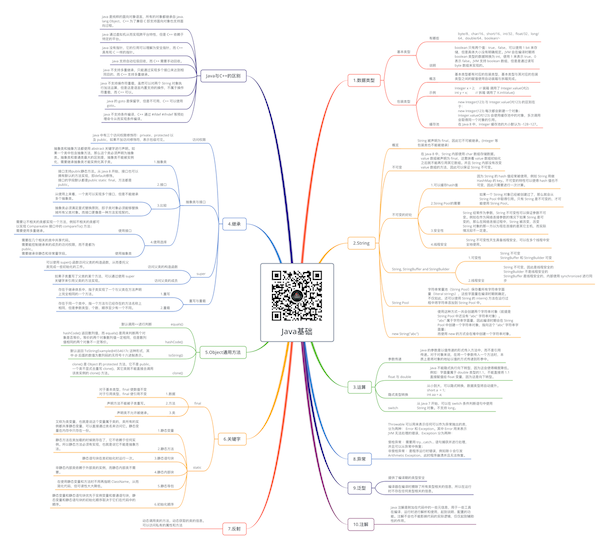

# Java基础

关注下方微信公众号，回复【思维导图】即可获得高清原图：

## 1.数据类型

### 基本类型

- 有哪些

	- byte/8、char/16、short/16、int/32、float/32、long/64、double/64、boolean/~

- 说明

	- boolean 只有两个值：true、false，可以使用 1 bit 来存储，但是具体大小没有明确规定。JVM 会在编译时期将 boolean 类型的数据转换为 int，使用 1 来表示 true，0 表示 false。JVM 支持 boolean 数组，但是是通过读写 byte 数组来实现的。

### 包装类型

- 概念

	- 基本类型都有对应的包装类型，基本类型与其对应的包装类型之间的赋值使用自动装箱与拆箱完成。

- 示例

	- Integer x = 2;     // 装箱 调用了 Integer.valueOf(2)
int y = x;         // 拆箱 调用了 X.intValue()

- 缓存池

	- new Integer(123) 与 Integer.valueOf(123) 的区别在于：
new Integer(123) 每次都会新建一个对象；
Integer.valueOf(123) 会使用缓存池中的对象，多次调用会取得同一个对象的引用。
在 Java 8 中，Integer 缓存池的大小默认为 -128~127。

## 2.String

### 概览

- String 被声明为 final，因此它不可被继承。(Integer 等包装类也不能被继承）

### 不可变

- 在 Java 8 中，String 内部使用 char 数组存储数据。value 数组被声明为 final，这意味着 value 数组初始化之后就不能再引用其它数组。并且 String 内部没有改变 value 数组的方法，因此可以保证 String 不可变。

### 不可变的好处

- 1.可以缓存hash值

	- 因为 String 的 hash 值经常被使用，例如 String 用做 HashMap 的 key。不可变的特性可以使得 hash 值也不可变，因此只需要进行一次计算。

- 2.String Pool的需要

	- 因为 String 的 hash 值经常被使用，例如 String 用做 HashMap 的 key。不可变的特性可以使得 hash 值也不可变，因此只需要进行一次计算。

- 3.安全性

	- String 经常作为参数，String 不可变性可以保证参数不可变。例如在作为网络连接参数的情况下如果 String 是可变的，那么在网络连接过程中，String 被改变，改变 String 对象的那一方以为现在连接的是其它主机，而实际情况却不一定是。

- 4.线程安全

	- String 不可变性天生具备线程安全，可以在多个线程中安全地使用。

### String, StringBuffer and StringBuilder

- 1.可变性

	- String 不可变
StringBuffer 和 StringBuilder 可变

- 2.线程安全

	- String 不可变，因此是线程安全的
StringBuilder 不是线程安全的
StringBuffer 是线程安全的，内部使用 synchronized 进行同步

### String Pool

- 字符串常量池（String Pool）保存着所有字符串字面量（literal strings），这些字面量在编译时期就确定。不仅如此，还可以使用 String 的 intern() 方法在运行过程中将字符串添加到 String Pool 中。

### new String("abc")

- 使用这种方式一共会创建两个字符串对象（前提是 String Pool 中还没有 "abc" 字符串对象）。
"abc" 属于字符串字面量，因此编译时期会在 String Pool 中创建一个字符串对象，指向这个 "abc" 字符串字面量；
而使用 new 的方式会在堆中创建一个字符串对象。

## 3.运算

### 参数传递

- Java 的参数是以值传递的形式传入方法中，而不是引用传递。对于对象来说，在将一个参数传入一个方法时，本质上是将对象的地址以值的方式传递到形参中。

### float 与 double

- Java 不能隐式执行向下转型，因为这会使得精度降低。
例如：字面量属于 double 类型的1.1，不能直接将 1.1 直接赋值给 float 变量，因为这是向下转型。

### 隐式类型转换

- 从小到大，可以隐式转换，数据类型将自动提升。
short a  = 1;
int aa = a;

### switch

- 从 Java 7 开始，可以在 switch 条件判断语句中使用 String 对象。不支持 long。

## 8.异常

### Throwable 可以用来表示任何可以作为异常抛出的类，分为两种： Error 和 Exception。其中 Error 用来表示 JVM 无法处理的错误，Exception 分为两种：

受检异常 ：需要用 try...catch... 语句捕获并进行处理，并且可以从异常中恢复；
非受检异常 ：是程序运行时错误，例如除 0 会引发 Arithmetic Exception，此时程序崩溃并且无法恢复。

## 9.泛型

### 提供了编译期的类型安全

### 编译器在编译时擦除了所有类型相关的信息，所以在运行时不存在任何类型相关的信息。

## 10.注解

### Java 注解是附加在代码中的一些元信息，用于一些工具在编译、运行时进行解析和使用，起到说明、配置的功能。注解不会也不能影响代码的实际逻辑，仅仅起到辅助性的作用。

## 7.反射

### 动态调用类的方法，动态获取的类的信息。
可以访问私有的属性和方法

## 6.关键字

### final

- 1.数据

	- 对于基本类型，final 使数值不变
对于引用类型，final 使引用不变

- 2.方法

	- 声明方法不能被子类重写。

- 3.类

	- 声明类不允许被继承。

### static

- 1.静态变量

	- 又称为类变量，也就是说这个变量属于类的，类所有的实例都共享静态变量，可以直接通过类名来访问它。静态变量在内存中只存在一份。

- 2.静态方法

	- 静态方法在类加载的时候就存在了，它不依赖于任何实例。所以静态方法必须有实现，也就是说它不能是抽象方法。

- 3.静态语句块

	- 静态语句块在类初始化时运行一次。

- 4.静态内部块

	- 非静态内部类依赖于外部类的实例，而静态内部类不需要。

- 5.静态导包

	- 在使用静态变量和方法时不用再指明 ClassName，从而简化代码，但可读性大大降低。

- 6.初始化顺序

	- 静态变量和静态语句块优先于实例变量和普通语句块，静态变量和静态语句块的初始化顺序取决于它们在代码中的顺序。

## 5.Object通用方法

### equals()

- 默认调用==进行判断

### hashCode()

- hashCode() 返回散列值，而 equals() 是用来判断两个对象是否等价。等价的两个对象散列值一定相同，但是散列值相同的两个对象不一定等价。

### toString()

- 默认返回 ToStringExample@4554617c 这种形式，其中 @ 后面的数值为散列码的无符号十六进制表示。

### clone()

- clone() 是 Object 的 protected 方法，它不是 public，一个类不显式去重写 clone()，其它类就不能直接去调用该类实例的 clone() 方法。

## 4.继承

### 访问权限

- Java 中有三个访问权限修饰符：private、protected 以及 public，如果不加访问修饰符，表示包级可见。

### 抽象类与接口

- 1.抽象类

	- 抽象类和抽象方法都使用 abstract 关键字进行声明。如果一个类中包含抽象方法，那么这个类必须声明为抽象类。抽象类和普通类最大的区别是，抽象类不能被实例化，需要继承抽象类才能实例化其子类。

- 2.接口

	- 接口支持public静态方法。从 Java 8 开始，接口也可以拥有默认的方法实现，即default修饰。
接口的字段默认都是public static  final，方法都是public。

- 3.比较

	- 从使用上来看，一个类可以实现多个接口，但是不能继承多个抽象类。
	- 抽象类必须满足里式替换原则，即子类对象必须能够替换掉所有父类对象。而接口更像是一种方法实现契约。

- 4.使用选择

	- 使用接口

		- 需要让不相关的类都实现一个方法，例如不相关的类都可以实现 Compareable 接口中的 compareTo() 方法；
需要使用多重继承。

	- 使用抽象类

		- 需要在几个相关的类中共享代码。
需要能控制继承来的成员的访问权限，而不是都为 public。
需要继承非静态和非常量字段。

### super

- 访问父类的构造函数

	- 可以使用 super() 函数访问父类的构造函数，从而委托父类完成一些初始化的工作。

- 访问父类的成员

	- 如果子类重写了父类的某个方法，可以通过使用 super 关键字来引用父类的方法实现。

### 重写与重载

- 1.重写

	- 存在于继承体系中，指子类实现了一个与父类在方法声明上完全相同的一个方法。

- 2.重载

	- 存在于同一个类中，指一个方法与已经存在的方法名称上相同，但是参数类型、个数、顺序至少有一个不同。

## Java与C++的区别

### Java 是纯粹的面向对象语言，所有的对象都继承自 java.lang.Object，C++ 为了兼容 C 即支持面向对象也支持面向过程。

### Java 通过虚拟机从而实现跨平台特性，但是 C++ 依赖于特定的平台。

### Java 没有指针，它的引用可以理解为安全指针，而 C++ 具有和 C 一样的指针。

### Java 支持自动垃圾回收，而 C++ 需要手动回收。

### Java 不支持多重继承，只能通过实现多个接口来达到相同目的，而 C++ 支持多重继承。

### Java 不支持操作符重载，虽然可以对两个 String 对象执行加法运算，但是这是语言内置支持的操作，不属于操作符重载，而 C++ 可以。

### Java 的 goto 是保留字，但是不可用，C++ 可以使用 goto。

### Java 不支持条件编译，C++ 通过 #ifdef #ifndef 等预处理命令从而实现条件编译。

*XMind: ZEN - Trial Version*