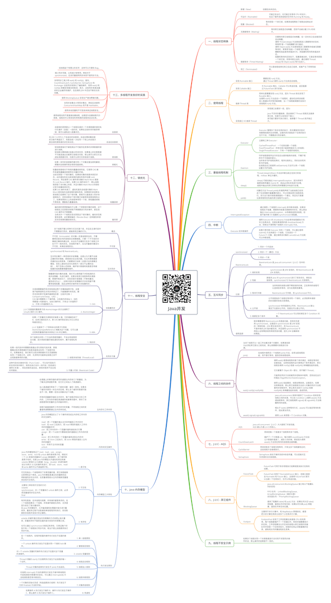

# Java并发

关注下方微信公众号，回复【思维导图】即可获得高清原图：

## 一、线程状态转换

### 新建（New）

- 创建后尚未启动。

### 可运行（Runnable）

- 可能正在运行，也可能正在等待 CPU 时间片。
包含了操作系统线程状态中的 Running 和 Ready。

### 阻塞（Blocked）

- 等待获取一个排它锁，如果其线程释放了锁就会结束此状态。

### 无限期等待（Waiting）

- 等待其它线程显式地唤醒，否则不会被分配 CPU 时间片。

### 限期等待（Timed Waiting）

- 无需等待其它线程显式地唤醒，在一定时间之后会被系统自动唤醒。
调用 Thread.sleep() 方法使线程进入限期等待状态时，常常用“使一个线程睡眠”进行描述。
调用 Object.wait() 方法使线程进入限期等待或者无限期等待时，常常用“挂起一个线程”进行描述。
睡眠和挂起是用来描述行为，而阻塞和等待用来描述状态。
阻塞和等待的区别在于，阻塞是被动的，它是在等待获取一个排它锁。而等待是主动的，通过调用 Thread.sleep() 和 Object.wait() 等方法进入。

### 死亡（Terminated）

- 可以是线程结束任务之后自己结束，或者产生了异常而结束。

## 二、使用线程

### 实现 Runnable 接口

- 需要实现 run() 方法。
通过 Thread 调用 start() 方法来启动线程。

### 实现 Callable 接口

- 与 Runnable 相比，Callable 可以有返回值，返回值通过 FutureTask 进行封装。

### 继承 Thread 类

- 同样也是需要实现 run() 方法，因为 Thread 类也实现了 Runable 接口。
当调用 start() 方法启动一个线程时，虚拟机会将该线程放入就绪队列中等待被调度，当一个线程被调度时会执行该线程的 run() 方法。

### 实现接口 VS 继承 Thread

- 实现接口会更好一些，因为：

Java 不支持多重继承，因此继承了 Thread 类就无法继承其它类，但是可以实现多个接口；
类可能只要求可执行就行，继承整个 Thread 类开销过大。

## 三、基础线程机制

### Executor

- Executor 管理多个异步任务的执行，而无需程序员显式地管理线程的生命周期。这里的异步是指多个任务的执行互不干扰，不需要进行同步操作。
- 主要有三种 Executor：

CachedThreadPool：一个任务创建一个线程；
FixedThreadPool：所有任务只能使用固定大小的线程；
SingleThreadExecutor：只有一个线程的线程池。

### Daemon

- 守护线程是程序运行时在后台提供服务的线程，不属于程序中不可或缺的部分。
当所有非守护线程结束时，程序也就终止，同时会杀死所有守护线程。
在线程启动之前使用 setDaemon() 方法可以将一个线程设置为守护线程。

### sleep()

- Thread.sleep(millisec) 方法会休眠当前正在执行的线程，millisec 单位为毫秒。

sleep() 可能会抛出 InterruptedException，因为异常不能跨线程传播回 main() 中，因此必须在本地进行处理。线程中抛出的其它异常也同样需要在本地进行处理。

### yield()

- 对静态方法 Thread.yield() 的调用声明了当前线程已经完成了生命周期中最重要的部分，可以切换给其它线程来执行。该方法只是对线程调度器的一个建议，而且也只是建议具有相同优先级的其它线程可以运行。

## 四、中断

### InterruptedException

- 通过调用一个线程的 interrupt() 来中断该线程，如果该线程处于阻塞、限期等待或者无限期等待状态，那么就会抛出 InterruptedException，从而提前结束该线程。但是不能中断 I/O 阻塞和 synchronized 锁阻塞。

### Executor 的中断操作

- 调用 Executor 的 shutdown() 方法会等待线程都执行完毕之后再关闭，但是如果调用的是 shutdownNow() 方法，则相当于调用每个线程的 interrupt() 方法。
- 如果只想中断 Executor 中的一个线程，可以通过使用 submit() 方法来提交一个线程，它会返回一个 Future<?> 对象，通过调用该对象的 cancel(true) 方法就可以中断线程。

## 五、互斥同步

### synchronized

- 1. 同步一个代码块
- 2. 同步一个（静态）方法
- 3. 同步一个类

### ReentrantLock

- ReentrantLock 是 java.util.concurrent（J.U.C）包中的锁。

### 比较

- 1. 锁的实现

	- synchronized 是 JVM 实现的，而 ReentrantLock 是 JDK 实现的。

- 2. 性能

	- 新版本 Java 对 synchronized 进行了很多优化，例如自旋锁等，synchronized 与 ReentrantLock 大致相同。

- 3. 等待可中断

	- 当持有锁的线程长期不释放锁的时候，正在等待的线程可以选择放弃等待，改为处理其他事情。

ReentrantLock 可中断，而 synchronized 不行。

- 4. 公平锁

	- 公平锁是指多个线程在等待同一个锁时，必须按照申请锁的时间顺序来依次获得锁。

synchronized 中的锁是非公平的，ReentrantLock 默认情况下也是非公平的，但是也可以是公平的。

- 5. 锁绑定多个条件

	- 一个 ReentrantLock 可以同时绑定多个 Condition 对象。

### 使用选择

- 除非需要使用 ReentrantLock 的高级功能，否则优先使用 synchronized。这是因为 synchronized 是 JVM 实现的一种锁机制，JVM 原生地支持它，而 ReentrantLock 不是所有的 JDK 版本都支持。并且使用 synchronized 不用担心没有释放锁而导致死锁问题，因为 JVM 会确保锁的释放。

## 六、线程之间的协作

### 当多个线程可以一起工作去解决某个问题时，如果某些部分必须在其它部分之前完成，那么就需要对线程进行协调。

### join()

- 在线程中调用另一个线程的 join() 方法，会将当前线程挂起，而不是忙等待，直到目标线程结束。

### wait() notify() notifyAll()

- 调用 wait() 使得线程等待某个条件满足，线程在等待时会被挂起，当其他线程的运行使得这个条件满足时，其它线程会调用 notify() 或者 notifyAll() 来唤醒挂起的线程。

它们都属于 Object 的一部分，而不属于 Thread。

只能用在同步方法或者同步控制块中使用，否则会在运行时抛出 IllegalMonitorStateException。

使用 wait() 挂起期间，线程会释放锁。这是因为，如果没有释放锁，那么其它线程就无法进入对象的同步方法或者同步控制块中，那么就无法执行 notify() 或者 notifyAll() 来唤醒挂起的线程，造成死锁。

### await() signal() signalAll()

- java.util.concurrent 类库中提供了 Condition 类来实现线程之间的协调，可以在 Condition 上调用 await() 方法使线程等待，其它线程调用 signal() 或 signalAll() 方法唤醒等待的线程。

相比于 wait() 这种等待方式，await() 可以指定等待的条件，因此更加灵活。

使用 Lock 来获取一个 Condition 对象。

## 七、J.U.C - AQS

### AQS

- java.util.concurrent（J.U.C）大大提高了并发性能，AQS 被认为是 J.U.C 的核心。

### CountDownLatch

- 用来控制一个或者多个线程等待多个线程。

维护了一个计数器 cnt，每次调用 countDown() 方法会让计数器的值减 1，减到 0 的时候，那些因为调用 await() 方法而在等待的线程就会被唤醒。

### CyclicBarrier

- 用来控制多个线程互相等待，只有当多个线程都到达时，这些线程才会继续执行。

### Semaphore

- Semaphore 类似于操作系统中的信号量，可以控制对互斥资源的访问线程数。

## 八、J.U.C - 其它组件

### FutureTask

- FutureTask 可用于异步获取执行结果或取消执行任务的场景。
- FutureTask 实现了 RunnableFuture 接口，该接口继承自 Runnable 和 Future 接口，这使得 FutureTask 既可以当做一个任务执行，也可以有返回值。

### BlockingQueue

- java.util.concurrent.BlockingQueue 接口有以下阻塞队列的实现：

FIFO 队列 ：LinkedBlockingQueue、ArrayBlockingQueue（固定长度）
优先级队列 ：PriorityBlockingQueue

提供了阻塞的 take() 和 put() 方法：如果队列为空 take() 将阻塞，直到队列中有内容；如果队列为满 put() 将阻塞，直到队列有空闲位置。

### ForkJoin

- 主要用于并行计算中，和 MapReduce 原理类似，都是把大的计算任务拆分成多个小任务并行计算。
- ForkJoinPool 实现了工作窃取算法来提高 CPU 的利用率。每个线程都维护了一个双端队列，用来存储需要执行的任务。工作窃取算法允许空闲的线程从其它线程的双端队列中窃取一个任务来执行。窃取的任务必须是最晚的任务，避免和队列所属线程发生竞争。

## 九、线程不安全示例

### 如果多个线程对同一个共享数据进行访问而不采取同步操作的话，那么操作的结果是不一致的。

## 十、Java 内存模型

### 主内存与工作内存

- 处理器上的寄存器的读写的速度比内存快几个数量级，为了解决这种速度矛盾，在它们之间加入了高速缓存。

加入高速缓存带来了一个新的问题：缓存一致性。如果多个缓存共享同一块主内存区域，那么多个缓存的数据可能会不一致，需要一些协议来解决这个问题。

所有的变量都存储在主内存中，每个线程还有自己的工作内存，工作内存存储在高速缓存或者寄存器中，保存了该线程使用的变量的主内存副本拷贝。

线程只能直接操作工作内存中的变量，不同线程之间的变量值传递需要通过主内存来完成。

### 内存间交互操作

- Java 内存模型定义了 8 个操作来完成主内存和工作内存的交互操作。

read：把一个变量的值从主内存传输到工作内存中
load：在 read 之后执行，把 read 得到的值放入工作内存的变量副本中
use：把工作内存中一个变量的值传递给执行引擎
assign：把一个从执行引擎接收到的值赋给工作内存的变量
store：把工作内存的一个变量的值传送到主内存中
write：在 store 之后执行，把 store 得到的值放入主内存的变量中
lock：作用于主内存的变量
unlock

### 内存模型三大特性

- 1. 原子性

	- Java 内存模型保证了 read、load、use、assign、store、write、lock 和 unlock 操作具有原子性，例如对一个 int 类型的变量执行 assign 赋值操作，这个操作就是原子性的。但是 Java 内存模型允许虚拟机将没有被 volatile 修饰的 64 位数据（long，double）的读写操作划分为两次 32 位的操作来进行，即 load、store、read 和 write 操作可以不具备原子性。

- 2. 可见性

	- 可见性指当一个线程修改了共享变量的值，其它线程能够立即得知这个修改。Java 内存模型是通过在变量修改后将新值同步回主内存，在变量读取前从主内存刷新变量值来实现可见性的。
	- 主要有三种实现可见性的方式：
volatile
synchronized，对一个变量执行 unlock 操作之前，必须把变量值同步回主内存。
final

- 3. 有序性

	- 有序性是指：在本线程内观察，所有操作都是有序的。在一个线程观察另一个线程，所有操作都是无序的，无序是因为发生了指令重排序。
在 Java 内存模型中，允许编译器和处理器对指令进行重排序，重排序过程不会影响到单线程程序的执行，却会影响到多线程并发执行的正确性。
	- volatile 关键字通过添加内存屏障的方式来禁止指令重排，即重排序时不能把后面的指令放到内存屏障之前。

也可以通过 synchronized 来保证有序性，它保证每个时刻只有一个线程执行同步代码，相当于是让线程顺序执行同步代码。

### 先行发生原则

- 1. 单一线程原则

	- 在一个线程内，在程序前面的操作先行发生于后面的操作。

- 2. 管程锁定规则

	- 一个 unlock 操作先行发生于后面对同一个锁的 lock 操作。

- 3. volatile 变量规则

	- 对一个 volatile 变量的写操作先行发生于后面对这个变量的读操作。

- 4. 线程启动规则

	- Thread 对象的 start() 方法调用先行发生于此线程的每一个动作。

- 5. 线程加入规则

	- Thread 对象的结束先行发生于 join() 方法返回。

- 6. 线程中断规则

	- 对线程 interrupt() 方法的调用先行发生于被中断线程的代码检测到中断事件的发生，可以通过 interrupted() 方法检测到是否有中断发生。

- 7. 对象终结规则

	- 一个对象的初始化完成（构造函数执行结束）先行发生于它的 finalize() 方法的开始。

- 8. 传递性

	- 如果操作 A 先行发生于操作 B，操作 B 先行发生于操作 C，那么操作 A 先行发生于操作 C。

## 十一、线程安全

### 概念

- 多个线程不管以何种方式访问某个类，并且在主调代码中不需要进行同步，都能表现正确的行为。

### 不可变

- 不可变（Immutable）的对象一定是线程安全的，不需要再采取任何的线程安全保障措施。只要一个不可变的对象被正确地构建出来，永远也不会看到它在多个线程之中处于不一致的状态。多线程环境下，应当尽量使对象成为不可变，来满足线程安全。

### 互斥同步

- synchronized 和 ReentrantLock。

互斥同步属于一种悲观的并发策略，总是认为只要不去做正确的同步措施，那就肯定会出现问题。无论共享数据是否真的会出现竞争，它都要进行加锁（这里讨论的是概念模型，实际上虚拟机会优化掉很大一部分不必要的加锁）、用户态核心态转换、维护锁计数器和检查是否有被阻塞的线程需要唤醒等操作。

### 非阻塞同步

- 随着硬件指令集的发展，我们可以使用基于冲突检测的乐观并发策略：先进行操作，如果没有其它线程争用共享数据，那操作就成功了，否则采取补偿措施（不断地重试，直到成功为止）。这种乐观的并发策略的许多实现都不需要将线程阻塞，因此这种同步操作称为非阻塞同步。
- 1. CAS

	- 乐观锁需要操作和冲突检测这两个步骤具备原子性，这里就不能再使用互斥同步来保证了，只能靠硬件来完成。硬件支持的原子性操作最典型的是：比较并交换（Compare-and-Swap，CAS）。
CAS 指令需要有 3 个操作数，分别是内存地址 V、旧的预期值 A 和新值 B。当执行操作时，只有当 V 的值等于 A，才将 V 的值更新为 B。

- 2. AtomicInteger

	- J.U.C 包里面的整数原子类 AtomicInteger 的方法调用了 Unsafe 类的 CAS 操作。

- 3. ABA

	- 如果一个变量初次读取的时候是 A 值，它的值被改成了 B，后来又被改回为 A，那 CAS 操作就会误认为它从来没有被改变过。

J.U.C 包提供了一个带有标记的原子引用类 AtomicStampedReference 来解决这个问题，它可以通过控制变量值的版本来保证 CAS 的正确性。

### 无同步方案

- 1. 栈封闭

	- 多个线程访问同一个方法的局部变量时，不会出现线程安全问题，因为局部变量存储在虚拟机栈中，属于线程私有的。

- 2. 线程本地存储（ThreadLocal）

	- 如果一段代码中所需要的数据必须与其他代码共享，那就看看这些共享数据的代码是否能保证在同一个线程中执行。如果能保证，我们就可以把共享数据的可见范围限制在同一个线程之内，这样，无须同步也能保证线程之间不出现数据争用的问题。

- 3. 可重入代码（Reentrant Code）

	- 这种代码也叫做纯代码（Pure Code），可以在代码执行的任何时刻中断它，转而去执行另外一段代码（包括递归调用它本身），而在控制权返回后，原来的程序不会出现任何错误。

## 十二、锁优化

### 自旋锁

- 自旋锁的思想是让一个线程在请求一个共享数据的锁时执行忙循环（自旋）一段时间，如果在这段时间内能获得锁，就可以避免进入阻塞状态。

### 自适应自旋锁

- 在 JDK 1.6 中引入了自适应的自旋锁。自适应意味着自旋的次数不再固定了，而是由前一次在同一个锁上的自旋次数及锁的拥有者的状态来决定。

### 锁消除

- 锁消除是指对于被检测出不可能存在竞争的共享数据的锁进行消除。
锁消除主要是通过逃逸分析来支持，如果堆上的共享数据不可能逃逸出去被其它线程访问到，那么就可以把它们当成私有数据对待，也就可以将它们的锁进行消除。

### 锁粗化

- 如果一系列的连续操作都对同一个对象反复加锁和解锁，频繁的加锁操作就会导致性能损耗。

### 轻量级锁

- 轻量级锁是相对于传统的重量级锁而言，它使用 CAS 操作来避免重量级锁使用互斥量的开销。
当尝试获取一个锁对象时，如果锁对象的锁是未锁定状态。此时虚拟机在当前线程的虚拟机栈中创建 Lock Record，然后使用 CAS 操作将对象的 Mark Word 更新为 Lock Record 指针。如果 CAS 操作成功了，那么线程就获取了该对象上的锁，并且对象的 Mark Word 的锁标记变为轻量级锁状态。
如果 CAS 操作失败了，虚拟机首先会检查对象的 Mark Word 是否指向当前线程的虚拟机栈，如果是的话说明当前线程已经拥有了这个锁对象，那就可以直接进入同步块继续执行，否则说明这个锁对象已经被其他线程线程抢占了。如果有两条以上的线程争用同一个锁，那轻量级锁就不再有效，要膨胀为重量级锁。

### 偏向锁

- 偏向锁的思想是偏向于让第一个获取锁对象的线程，这个线程在之后获取该锁就不再需要进行同步操作，甚至连 CAS 操作也不再需要。
当有另外一个线程去尝试获取这个锁对象时，偏向状态就宣告结束，此时撤销偏向（Revoke Bias）后恢复到未锁定状态或者轻量级锁状态。

## 十三、多线程开发良好的实践

### 给线程起个有意义的名字，这样可以方便找 Bug。

### 缩小同步范围，从而减少锁争用。例如对于 synchronized，应该尽量使用同步块而不是同步方法。

### 多用同步工具少用 wait() 和 notify()。首先，CountDownLatch, CyclicBarrier, Semaphore 和 Exchanger 这些同步类简化了编码操作，而用 wait() 和 notify() 很难实现复杂控制流；其次，这些同步类是由最好的企业编写和维护，在后续的 JDK 中还会不断优化和完善。

### 使用 BlockingQueue 实现生产者消费者问题。

### 多用并发集合少用同步集合，例如应该使用 ConcurrentHashMap 而不是 Hashtable。

### 使用本地变量和不可变类来保证线程安全。

### 使用线程池而不是直接创建线程，这是因为创建线程代价很高，线程池可以有效地利用有限的线程来启动任务。

*XMind: ZEN - Trial Version*