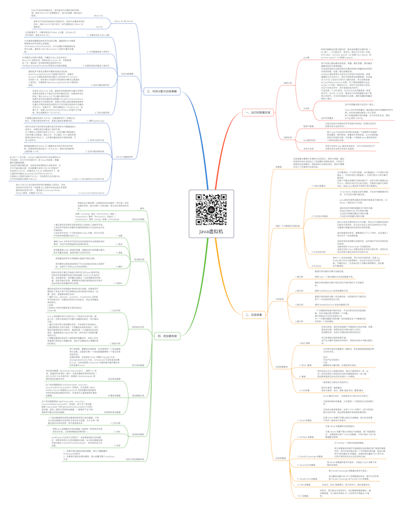

# Java虚拟机

关注下方微信公众号，回复【思维导图】即可获得高清原图：

## 一、运行时数据区域

### 线程公有

- Java堆

	- 所有对象都在这里分配内存，是垃圾收集的主要区域（"GC 堆"）。分为新生代，老年代。新生代又可进一步细分为 eden、survivor space0（s0 或者 from space）和 survivor space1（s1或者to space）。

- 方法区

	- 用于存放已被加载的类信息、常量、静态变量、即时编译器编译后的代码等数据。
对这块区域进行垃圾回收的主要目标是对常量池的回收和对类的卸载，但是一般比较难实现。
HotSpot 虚拟机把它当成永久代来进行垃圾回收。但很难确定永久代的大小，因为它受到很多因素影响，并且每次 Full GC 之后永久代的大小都会改变，所以经常会抛出 OutOfMemoryError 异常。为了更容易管理方法区，从 JDK 1.8 开始，移除永久代，并把方法区移至元空间，它位于本地内存中，而不是虚拟机内存中。
方法区是一个 JVM 规范，永久代与元空间都是其一种实现方式。在 JDK 1.8 之后，原来永久代的数据被分到了堆和元空间中。元空间存储类的元信息，静态变量和常量池等放入堆中。
	- 运行时常量池

		- 运行时常量池是方法区的一部分。

Class 文件中的常量池（编译器生成的字面量和符号引用）会在类加载后被放入这个区域。
除了在编译期生成的常量，还允许动态生成，例如 String 类的 intern()。

### 线程私有

- 程序计数器

	- 记录正在执行的虚拟机字节码指令的地址（如果正在执行的是本地方法则为空）。

- Java虚拟机栈

	- 每个 Java 方法在执行的同时会创建一个栈帧用于存储局部变量表、操作数栈、常量池引用等信息。从方法调用直至执行完成的过程，对应着一个栈帧在 Java 虚拟机栈中入栈和出栈的过程。

- 本地方法栈

	- 本地方法栈与 Java 虚拟机栈类似，它们之间的区别只不过是本地方法栈为本地方法服务。

## 二、垃圾收集

### 在哪里

- 垃圾收集主要是针对堆和方法区进行。程序计数器、虚拟机栈和本地方法栈这三个区域属于线程私有的，只存在于线程的生命周期内，线程结束之后就会消失，因此不需要对这三个区域进行垃圾回收。

### 判断一个对象是否可被回收

- 1.引用计数算法

	- 为对象添加一个引用计数器，当对象增加一个引用时计数器加 1，引用失效时计数器减 1。引用计数为 0 的对象可被回收。
在两个对象出现循环引用的情况下，此时引用计数器永远不为 0，导致无法对它们进行回收。正是因为循环引用的存在，因此 Java 虚拟机不使用引用计数算法。

- 2. 可达性分析算法

	- 以 GC Roots 为起始点进行搜索，可达的对象都是存活的，不可达的对象可被回收。

Java 虚拟机使用该算法来判断对象是否可被回收，GC Roots 一般包含以下内容：

虚拟机栈中局部变量表中引用的对象
本地方法栈中 JNI 中引用的对象
方法区中类静态属性引用的对象
方法区中的常量引用的对象

- 3.方法区的回收

	- 因为方法区主要存放永久代对象，而永久代对象的回收率比新生代低很多，所以在方法区上进行回收性价比不高。
主要是对常量池的回收和对类的卸载。

类的卸载条件很多，需要满足以下三个条件，并且满足了条件也不一定会被卸载：

该类所有的实例都已经被回收，此时堆中不存在该类的任何实例。
加载该类的 ClassLoader 已经被回收。
该类对应的 Class 对象没有在任何地方被引用，也就无法在任何地方通过反射访问该类方法。

- 4.finalize()

	- 类似 C++ 的析构函数，用于关闭外部资源。但是 try-finally 等方式可以做得更好，并且该方法运行代价很高，不确定性大，无法保证各个对象的调用顺序，因此最好不要使用。

### 引用类型

- 1.强引用

	- 被强引用关联的对象不会被回收。

使用 new 一个新对象的方式来创建强引用。

- 2.软引用

	- 被软引用关联的对象只有在内存不够的情况下才会被回收。

使用 SoftReference 类来创建软引用。

- 3.弱引用

	- 被弱引用关联的对象一定会被回收，也就是说它只能存活到下一次垃圾回收发生之前。

使用 WeakReference 类来创建弱引用

- 4.虚引用

	- 一个对象是否有虚引用的存在，不会对其生存时间造成影响，也无法通过虚引用得到一个对象。
虚引用的get方法永远返回null。
为一个对象设置虚引用的唯一目的是能在这个对象被回收时收到一个系统通知。

### 垃圾收集算法

- 1.标记-清除

	- 在标记阶段，程序会检查每个对象是否为活动对象，如果是活动对象，则程序会在对象头部打上标记。
在清除阶段，会进行对象回收并取消标志位。

标记和清除过程效率都不高；
会产生大量不连续的内存碎片，导致无法给大对象分配内存。

- 2. 标记 - 整理

	- 让所有存活的对象都向一端移动，然后直接清理掉端边界以外的内存。

优点:
不会产生内存碎片
不足:
需要移动大量对象，处理效率比较低。

- 3. 复制

	- 将内存划分为大小相等的两块，每次只使用其中一块，当这一块内存用完了就将还存活的对象复制到另一块上面，然后再把使用过的内存空间进行一次清理。

- 4. 分代收集

	- 一般将堆分为新生代和老年代。

新生代使用：复制算法
老年代使用：标记 - 清除 或者 标记 - 整理 算法

### 垃圾收集器

- 1. Serial 收集器

	- Serial 翻译为串行，也就是说它以串行的方式执行。

它是单线程的收集器，只会使用一个线程进行垃圾收集工作。

它的优点是简单高效，在单个 CPU 环境下，由于没有线程交互的开销，因此拥有最高的单线程收集效率。

它是 Client 场景下的默认新生代收集器，因为在该场景下内存一般来说不会很大。

- 2. ParNew 收集器

	- 它是 Serial 收集器的多线程版本。

它是 Server 场景下默认的新生代收集器，除了性能原因外，主要是因为除了 Serial 收集器，只有它能与 CMS 收集器配合使用。

- 3. Parallel Scavenge 收集器

	- 与 ParNew 一样是多线程收集器。

其它收集器目标是尽可能缩短垃圾收集时用户线程的停顿时间，而它的目标是达到一个可控制的吞吐量，因此它被称为“吞吐量优先”收集器。这里的吞吐量指 CPU 用于运行用户程序的时间占总时间的比值。

- 4. Serial Old 收集器

	- 是 Serial 收集器的老年代版本，也是给 Client 场景下的虚拟机使用。

- 5. Parallel Old 收集器

	- 是 Parallel Scavenge 收集器的老年代版本。

在注重吞吐量以及 CPU 资源敏感的场合，都可以优先考虑 Parallel Scavenge 加 Parallel Old 收集器。

- 6. CMS 收集器

	- 并发式，标记-清楚算法，用于老年代，响应速度优先

- 7.G1 收集器

	- 并发式，用于新生代和老年代，标记整理和复制算法，面向服务端，可以指定消耗在 GC 上的时间不得超过 N 毫秒。

## 四、类加载机制

### 概述

- 类是在运行期间第一次使用时动态加载的，而不是一次性加载所有类。因为如果一次性加载，那么会占用很多的内存。

### 类的生命周期

- 加载（Loading）验证（Verification）准备（Preparation）解析（Resolution）初始化（Initialization）使用（Using）卸载（Unloading）

### 类加载过程

- 1. 加载

	- 1.通过类的完全限定名称获取定义该类的二进制字节流。
2.将该字节流表示的静态存储结构转换为方法区的运行时存储结构。
3.在内存中生成一个代表该类的 Class 对象，作为方法区中该类各种数据的访问入口。

- 2. 验证

	- 确保 Class 文件的字节流中包含的信息符合当前虚拟机的要求，并且不会危害虚拟机自身的安全。

- 3. 准备

	- 类变量是被 static 修饰的变量，准备阶段为类变量分配内存并设置初始值，使用的是方法区的内存。

- 4. 解析

	- 将常量池的符号引用替换为直接引用的过程。

其中解析过程在某些情况下可以在初始化阶段之后再开始，这是为了支持 Java 的动态绑定。

- 5. 初始化

	- 初始化阶段才真正开始执行类中定义的 Java 程序代码。初始化阶段是虚拟机执行类构造器 <clinit>() 方法的过程。在准备阶段，类变量已经赋过一次系统要求的初始值，而在初始化阶段，根据程序员通过程序制定的主观计划去初始化类变量和其它资源。

### 类初始化时机

- 1. 主动引用

	- 虚拟机规范中并没有强制约束何时进行加载，但是规范严格规定了有且只有下列五种情况必须对类进行初始化（加载、验证、准备都会随之发生）
1.遇到 new、getstatic、putstatic、invokestatic 这四条字节码指令时，如果类没有进行过初始化，则必须先触发其初始化。
2.反射
3.初始化子类时先触发其父类的初始化
4.Main类

- 2. 被动引用

	- 以上 5 种场景中的行为称为对一个类进行主动引用。除此之外，所有引用类的方式都不会触发初始化，称为被动引用。
1.通过子类引用父类的静态字段，不会导致子类初始化。
2.通过数组定义来引用类，不会触发此类的初始化。该过程会对数组类进行初始化，数组类是一个由虚拟机自动生成的、直接继承自 Object 的子类，其中包含了数组的属性和方法。
3.常量在编译阶段会存入调用类的常量池中，本质上并没有直接引用到定义常量的类，因此不会触发定义常量的类的初始化。

### 类与类加载器

- 两个类相等，需要类本身相等，并且使用同一个类加载器进行加载。这是因为每一个类加载器都拥有一个独立的类名称空间。
这里的相等，包括类的 Class 对象的 equals() 方法、isAssignableFrom() 方法、isInstance() 方法的返回结果为 true，也包括使用 instanceof 关键字做对象所属关系判定结果为 true。

### 类加载器分类

- 启动类加载器

	- 启动类加载器（Bootstrap ClassLoader），使用 C++ 实现，是虚拟机自身的一部分；此类加载器负责将存放在 <JRE_HOME>\lib 目录中的，或者被 -Xbootclasspath 参数所指定的路径中的

- 扩展类加载器

	- 这个类加载器是由 ExtClassLoader（sun.misc.Launcher$ExtClassLoader）实现的。它负责将 <JAVA_HOME>/lib/ext 或者被 java.ext.dir 系统变量所指定路径中的所有类库加载到内存中，开发者可以直接使用扩展类加载器。

- 应用程序类加载器

	- 这个类加载器是由 AppClassLoader（sun.misc.Launcher$AppClassLoader）实现的。由于这个类加载器是 ClassLoader 中的 getSystemClassLoader() 方法的返回值，因此一般称为系统类加载器。一般情况下这个就是程序中默认的类加载器。

### 双亲委派模型

- 1.工作过程

	- 一个类加载器首先将类加载请求转发到父类加载器，只有当父类加载器无法完成时才尝试自己加载。父子关系一般通过组合关系来实现，而不是继承关系

- 2. 好处

	- 使得 Java 类随着它的类加载器一起具有一种带有优先级的层次关系，从而使得基础类得到统一。

- 3. 实现

	- loadClass() 方法运行过程如下：先检查类是否已经加载过，如果没有则让父类加载器去加载。当父类加载器加载失败时抛出 ClassNotFoundException，此时尝试自己去加载。

### 自定义类加载器实现

- 1、如果不想打破双亲委派模型，那么只需要重写findClass方法即可
2、如果想打破双亲委派模型，那么就重写整个loadClass方法

## 三、内存分配与回收策略

### Minor GC 和 Full GC

- Minor GC

	- Eden不足时回收新生代，因为新生代对象存活时间很短，因此 Minor GC 会频繁执行，执行的速度一般也会比较快。

- Full GC

	- 老年代不足时回收老年代和新生代，老年代对象其存活时间长，因此 Full GC 很少执行，执行速度会比 Minor GC 慢很多。

### 内存分配策略

- 1. 对象优先在 Eden 分配

	- 大多数情况下，对象在新生代 Eden 上分配，当 Eden 空间不够时，发起 Minor GC。

- 2. 大对象直接进入老年代

	- 大对象是指需要连续内存空间的对象，最典型的大对象是那种很长的字符串以及数组。
-XX:PretenureSizeThreshold，大于此值的对象直接在老年代分配，避免在 Eden 和 Survivor 之间的大量内存复制。

- 3. 长期存活的对象进入老年代

	- 为对象定义年龄计数器，对象在 Eden 出生并经过 Minor GC 依然存活，将移动到 Survivor 中，年龄就增加 1 岁，增加到一定年龄则移动到老年代中。
-XX:MaxTenuringThreshold 用来定义年龄的阈值。

- 4. 动态对象年龄判定

	- 虚拟机并不是永远要求对象的年龄必须达到 MaxTenuringThreshold 才能晋升老年代，如果在 Survivor 中相同年龄所有对象大小的总和大于 Survivor 空间的一半，则年龄大于或等于该年龄的对象可以直接进入老年代，无需等到 MaxTenuringThreshold 中要求的年龄。

- 5. 空间分配担保

	- 在发生 Minor GC 之前，虚拟机先检查老年代最大可用的连续空间是否大于新生代所有对象总空间，如果条件成立的话，那么 Minor GC 可以确认是安全的。
如果不成立的话虚拟机会查看 HandlePromotionFailure 的值是否允许担保失败，如果允许那么就会继续检查老年代最大可用的连续空间是否大于历次晋升到老年代对象的平均大小，如果大于，将尝试着进行一次 Minor GC；如果小于，或者 HandlePromotionFailure 的值不允许冒险，那么就要进行一次 Full GC。

### Full GC 的触发条件

- 1. 调用 System.gc()

	- 只是建议虚拟机执行 Full GC，但是虚拟机不一定真正去执行。不建议使用这种方式，而是让虚拟机管理内存。

- 2. 老年代空间不足

	- 老年代空间不足的常见场景为前文所讲的大对象直接进入老年代、长期存活的对象进入老年代等。
为了避免以上原因引起的 Full GC，应当尽量不要创建过大的对象以及数组。除此之外，可以通过 -Xmn 虚拟机参数调大新生代的大小，让对象尽量在新生代被回收掉，不进入老年代。

- 3. 空间分配担保失败

	- 使用复制算法的 Minor GC 需要老年代的内存空间作担保，如果担保失败会执行一次 Full GC。具体内容请参考上面的第 5 小节。

- 4. JDK 1.7 及以前的永久代空间不足

	- 在 JDK 1.7 及以前，HotSpot 虚拟机中的方法区是用永久代实现的，永久代中存放的为一些 Class 的信息、常量、静态变量等数据。
当系统中要加载的类、反射的类和调用的方法较多时，永久代可能会被占满，在未配置为采用 CMS GC 的情况下也会执行 Full GC。如果经过 Full GC 仍然回收不了，那么虚拟机会抛出 java.lang.OutOfMemoryError。
为避免以上原因引起的 Full GC，可采用的方法为增大永久代空间或转为使用 CMS GC。

- 5. Concurrent Mode Failure

	- 执行 CMS GC 的过程中同时有对象要放入老年代，而此时老年代空间不足（可能是 GC 过程中浮动垃圾过多导致暂时性的空间不足），便会报 Concurrent Mode Failure 错误，并触发 Full GC。

*XMind: ZEN - Trial Version*