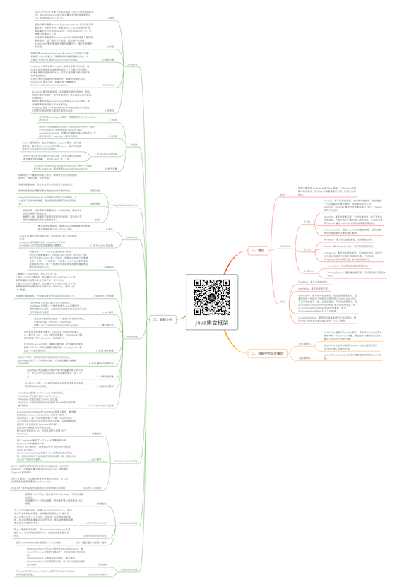

# Java集合框架

关注下方微信公众号，回复【思维导图】即可获得高清原图：

## 一、概览

### 区别

- 容器主要包括 Collection 和 Map 两种，Collection 存储着对象的集合，而 Map 存储着键值对（两个对象）的映射表。

### Collection

- 1. Set

	- TreeSet：基于红黑树实现，支持有序性操作，例如根据一个范围查找元素的操作。但是查找效率不如 HashSet，HashSet 查找的时间复杂度为 O(1)，TreeSet 则为 O(logN)。
	- HashSet：基于哈希表实现，支持快速查找，但不支持有序性操作。并且失去了元素的插入顺序信息，也就是说使用 Iterator 遍历 HashSet 得到的结果是不确定的。
	- LinkedHashSet：具有 HashSet 的查找效率，且内部使用双向链表维护元素的插入顺序。

- 2. List

	- ArrayList：基于动态数组实现，支持随机访问。
	- Vector：和 ArrayList 类似，但它是线程安全的。
	- LinkedList：基于双向链表实现，只能顺序访问，但是可以快速地在链表中间插入和删除元素。不仅如此，LinkedList 还可以用作栈、队列和双向队列。

- 3. Queue

	- LinkedList：可以用它来实现双向队列。
	- PriorityQueue：基于堆结构实现，可以用它来实现优先队列。

### Map

- TreeMap：基于红黑树实现。
- HashMap：基于哈希表实现。
- HashTable：和 HashMap 类似，但它是线程安全的，这意味着同一时刻多个线程可以同时写入 HashTable 并且不会导致数据不一致。它是遗留类，不应该去使用它。现在可以使用 ConcurrentHashMap 来支持线程安全，并且 ConcurrentHashMap 的效率会更高，因为 ConcurrentHashMap 引入了分段锁。
- LinkedHashMap：使用双向链表来维护元素的顺序，顺序为插入顺序或者最近最少使用（LRU）顺序。

## 二、容器中的设计模式

### 迭代器模式

- Collection 继承了 Iterable 接口，其中的 iterator() 方法能够产生一个 Iterator 对象，通过这个对象就可以迭代遍历 Collection 中的元素。
- 从 JDK 1.5 之后可以使用 foreach 方法来遍历实现了 Iterable 接口的聚合对象。

### 适配器模式

- java.util.Arrays#asList() 可以把数组类型转换为 List 类型。

## 三、源码分析

### ArrayList

- 1. 概览

	- 因为 ArrayList 是基于数组实现的，所以支持快速随机访问。RandomAccess 接口标识着该类支持快速随机访问。数组的默认大小为 10。

- 2. 扩容

	- 添加元素时使用 ensureCapacityInternal() 方法来保证容量足够，如果不够时，需要使用 grow() 方法进行扩容，新容量的大小为 oldCapacity + (oldCapacity >> 1)，也就是旧容量的 1.5 倍。
扩容操作需要调用 Arrays.copyOf() 把原数组整个复制到新数组中，这个操作代价很高，因此最好在创建 ArrayList 对象时就指定大概的容量大小，减少扩容操作的次数。

- 3. 删除元素

	- 需要调用 System.arraycopy() 将 index+1 后面的元素都复制到 index 位置上，该操作的时间复杂度为 O(N)，可以看出 ArrayList 删除元素的代价是非常高的。

- 4. Fail-Fast

	- modCount 用来记录 ArrayList 结构发生变化的次数。结构发生变化是指添加或者删除至少一个元素的所有操作，或者是调整内部数组的大小，仅仅只是设置元素的值不算结构发生变化。
在进行序列化或者迭代等操作时，需要比较操作前后 modCount 是否改变，如果改变了需要抛出 ConcurrentModificationException。

- 5. 序列化

	- ArrayList 基于数组实现，并且具有动态扩容特性，因此保存元素的数组不一定都会被使用，那么就没必要全部进行序列化。
保存元素的数组 elementData 使用 transient 修饰，该关键字声明数组默认不会被序列化。
ArrayList 实现了 writeObject() 和 readObject() 来控制只序列化数组中有元素填充那部分内容。

### Vector

- 1. 同步

	- 它的实现与 ArrayList 类似，但是使用了 synchronized 进行同步。

- 2. 扩容

	- Vector 的构造函数可以传入 capacityIncrement 参数，它的作用是在扩容时使容量 capacity 增长 capacityIncrement。如果这个参数的值小于等于 0，扩容时每次都令 capacity 为原来的两倍。

- 3. 与 ArrayList 的比较

	- Vector 是同步的，因此开销就比 ArrayList 要大，访问速度更慢。最好使用 ArrayList 而不是 Vector，因为同步操作完全可以由程序员自己来控制；
	- Vector 每次扩容请求其大小的 2 倍（也可以通过构造函数设置增长的容量），而 ArrayList 是 1.5 倍。

- 4. 替代方案

	- 可以使用 Collections.synchronizedList(); 得到一个线程安全的 ArrayList。或者使用CopyOnWriteArrayList。

### CopyOnWriteArrayList

- 读写分离

	- 写操作在一个复制的数组上进行，读操作还是在原始数组中进行，读写分离，互不影响。

写操作需要加锁，防止并发写入时导致写入数据丢失。

写操作结束之后需要把原始数组指向新的复制数组。

- 适用场景

	- CopyOnWriteArrayList 在写操作的同时允许读操作，大大提高了读操作的性能，因此很适合读多写少的应用场景。

- 缺点

	- 内存占用：在写操作时需要复制一个新的数组，使得内存占用为原来的两倍左右；
数据不一致：读操作不能读取实时性的数据，因为部分写操作的数据还未同步到读数组中。

### LinkedList

- 1. 概览

	- 基于双向链表实现，使用 Node 存储链表节点信息。
每个链表存储了 first 和 last 指针：

- 2. 与 ArrayList 的比较

	- ArrayList 基于动态数组实现，LinkedList 基于双向链表实现；
ArrayList 支持随机访问，LinkedList 不支持；
LinkedList 在任意位置添加删除元素更快。

### HashMap

- 1. 存储结构

	- 内部包含了一个 Entry 类型的数组 table。
Entry 存储着键值对。它包含了四个字段，从 next 字段我们可以看出 Entry 是一个链表。即数组中的每个位置被当成一个桶，一个桶存放一个链表。HashMap 使用拉链法来解决冲突，同一个链表中存放哈希值和散列桶取模运算结果相同的 Entry。

- 2. 拉链法的工作原理

	- 1. 新建一个 HashMap，默认大小为 16；
2. 插入 <K2,V2> 键值对，先计算 K2 的 hashCode 为 118，使用除留余数法得到所在的桶下标 118%16=6。
3. 插入 <K3,V3> 键值对，先计算 K3 的 hashCode 为 118，使用除留余数法得到所在的桶下标 118%16=6，插在 <K2,V2> 前面。

在链表上顺序查找，时间复杂度显然和链表的长度成正比。

- 3. put 操作

	- HashMap 允许插入键为 null 的键值对。
HashMap 使用第 0 个桶存放键为 null 的键值对。
使用链表的头插法，也就是新的键值对插在链表的头部，而不是链表的尾部。

- 4. 确定桶下标

	- 很多操作都需要先确定一个键值对所在的桶下标。
计算hash值：int hash = hash(key);
取模：int i = indexFor(hash, table.length);

- 5. 扩容-基本原理

	- 和扩容相关的参数主要有：capacity（table 的容量大小，默认为 16）、size（键值对数量）、threshold（键值对数量）和 load_factor（装载因子）。

扩容使用 resize() 实现，需要注意的是，扩容操作同样需要把 oldTable 的所有键值对重新插入 newTable 中，因此这一步是很费时的。

- 6. 扩容-重新计算桶下标

	- 在进行扩容时，需要把键值对重新放到对应的桶上。HashMap 使用了一个特殊的机制，可以降低重新计算桶下标的操作。

- 7. 计算数组容量

	- HashMap 构造函数允许用户传入的容量不是 2 的 n 次方，因为它可以自动地将传入的容量转换为 2 的 n 次方。

- 8. 链表转红黑树

	- 从 JDK 1.8 开始，一个桶存储的链表长度大于等于 8 时会将链表转换为红黑树。

- 9. 与 HashTable 的比较

	- HashTable 使用 synchronized 来进行同步。
HashMap 可以插入键为 null 的 Entry。
HashMap 的迭代器是 fail-fast 迭代器。
HashMap 不能保证随着时间的推移 Map 中的元素次序是不变的。

### ConcurrentHashMap

- 1. 存储结构

	- ConcurrentHashMap 和 HashMap 实现上类似，最主要的差别是 ConcurrentHashMap 采用了分段锁（Segment），每个分段锁维护着几个桶（HashEntry），多个线程可以同时访问不同分段锁上的桶，从而使其并发度更高（并发度就是 Segment 的个数）。
Segment 继承自 ReentrantLock。
默认的并发级别为 16，也就是说默认创建 16 个 Segment。

- 2. size 操作

	- 每个 Segment 维护了一个 count 变量来统计该 Segment 中的键值对个数。
在执行 size 操作时，需要遍历所有 Segment 然后把 count 累计起来。
ConcurrentHashMap 在执行 size 操作时先尝试不加锁，如果连续两次不加锁操作得到的结果一致，那么可以认为这个结果是正确的。

- 3. JDK 1.8 的改动

	- JDK 1.7 使用分段锁机制来实现并发更新操作，核心类为 Segment，它继承自重入锁 ReentrantLock，并发度与 Segment 数量相等。

JDK 1.8 使用了 CAS 操作来支持更高的并发度，在 CAS 操作失败时使用内置锁 synchronized。

并且 JDK 1.8 的实现也在链表过长时会转换为红黑树。

### LinkedHashMap

- 存储结构

	- 继承自 HashMap，因此具有和 HashMap 一样的快速查找特性。
内部维护了一个双向链表，用来维护插入顺序或者 LRU 顺序。

- afterNodeAccess()

	- 当一个节点被访问时，如果 accessOrder 为 true，则会将该节点移到链表尾部。也就是说指定为 LRU 顺序之后，在每次访问一个节点时，会将这个节点移到链表尾部，保证链表尾部是最近访问的节点，那么链表首部就是最近最久未使用的节点。

- afterNodeInsertion()

	- 在 put 等操作之后执行，当 removeEldestEntry() 方法返回 true 时会移除最晚的节点，也就是链表首部节点 first。

- LRU （最近最少未使用）缓存

	- 使用 LinkedHashMap 实现的一个 LRU 缓存

### WeakHashMap

- 存储结构

	- WeakHashMap 的 Entry 继承自 WeakReference，被 WeakReference 关联的对象在下一次垃圾回收时会被回收。
WeakHashMap 主要用来实现缓存，通过使用 WeakHashMap 来引用缓存对象，由 JVM 对这部分缓存进行回收。

- ConcurrentCache

	- Tomcat 中的 ConcurrentCache 使用了 WeakHashMap 来实现缓存功能。

*XMind: ZEN - Trial Version*