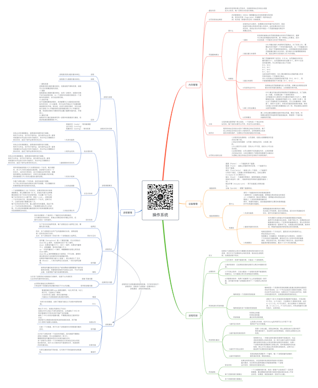

# 操作系统

关注下方微信公众号，回复【思维导图】即可获得高清原图：

## 内存管理

### 虚拟内存

- 虚拟内存采用的是分页技术，也就是将地址空间划分成固定大小的页，每一页再与内存进行映射。

### 分页系统地址映射

- 内存管理单元（MMU）管理着地址空间和物理内存的转换，其中的页表（Page table）存储着页（程序地址空间）和页框（物理内存空间）的映射表。

### 页面置换算法

- 是什么

	- 在程序运行过程中，如果要访问的页面不在内存中，就发生缺页中断从而将该页调入内存中。此时如果内存已无空闲空间，系统必须从内存中调出一个页面到磁盘对换区中来腾出空间。

- 有哪些

	- 1.最佳

		- 所选择的被换出的页面将是最长时间内不再被访问，通常可以保证获得最低的缺页率。是一种理论上的算法，因为无法知道一个页面多长时间不再被访问。

	- 2.最近最久未使用

		- LRU 将最近最久未使用的页面换出。为了实现 LRU，需要在内存中维护一个所有页面的链表。当一个页面被访问时，将这个页面移到链表表头。这样就能保证链表表尾的页面是最近最久未访问的。因为每次访问都需要更新链表，因此这种方式实现的 LRU 代价很高。

	- 3.最近未使用

		- 每个页面都有两个状态位：R 与 M，当页面被访问时设置页面的 R=1，当页面被修改时设置 M=1。其中 R 位会定时被清零。可以将页面分成以下四类：
R=0，M=0
R=0，M=1
R=1，M=0
R=1，M=1
当发生缺页中断时，NRU 算法随机地从类编号最小的非空类中挑选一个页面将它换出。
NRU 优先换出已经被修改的脏页面（R=0，M=1），而不是被频繁使用的干净页面（R=1，M=0）。

	- 4.先进先出(FIFO)

		- 选择换出的页面是最先进入的页面。该算法会将那些经常被访问的页面也被换出，从而使缺页率升高。

	- 5.第二次机会算法

		- FIFO 算法可能会把经常使用的页面置换出去，为了避免这一问题，对该算法做一个简单的修改：
当页面被访问 (读或写) 时设置该页面的 R 位为 1。需要替换的时候，检查最老页面的 R 位。如果 R 位是 0，那么这个页面既老又没有被使用，可以立刻置换掉；如果是 1，就将 R 位清 0，并把该页面放到链表的尾端，修改它的装入时间使它就像刚装入的一样，然后继续从链表的头部开始搜索。

	- 6.时钟算法

		- 第二次机会算法需要在链表中移动页面，降低了效率。时钟算法使用环形链表将页面连接起来，再使用一个指针指向最老的页面。

### 分段

- 分段的做法是把每个表分成段，一个段构成一个独立的地址空间。每个段的长度可以不同，并且可以动态增长。

### 段页式

- 程序的地址空间划分成多个拥有独立地址空间的段，每个段上的地址空间划分成大小相同的页。这样既拥有分段系统的共享和保护，又拥有分页系统的虚拟内存功能。

### 分页和分段的比较

- 1.对程序员的透明性：分页透明，但是分段需要程序员显式划分每个段。
2.地址空间的维度：分页是一维地址空间，分段是二维的。
3.大小是否可以改变：页的大小不可变，段的大小可以动态改变。
4.出现的原因：分页主要用于实现虚拟内存，从而获得更大的地址空间；分段主要是为了使程序和数据可以被划分为逻辑上独立的地址空间并且有助于共享和保护。

## 设备管理·

### 磁盘结构

- 盘面（Platter）：一个磁盘有多个盘面；
磁道（Track）：盘面上的圆形带状区域，一个盘面可以有多个磁道；
扇区（Track Sector）：磁道上的一个弧段，一个磁道可以有多个扇区，它是最小的物理储存单位，目前主要有 512 bytes 与 4 K 两种大小；
磁头（Head）：与盘面非常接近，能够将盘面上的磁场转换为电信号（读），或者将电信号转换为盘面的磁场（写）；
制动手臂（Actuator arm）：用于在磁道之间移动磁头；
主轴（Spindle）：使整个盘面转动。

### 磁盘调度算法

- 是什么

	- 读写一个磁盘块的时间的影响因素有：
1.旋转时间（主轴转动盘面，使得磁头移动到适当的扇区上）2.寻道时间（制动手臂移动，使得磁头移动到适当的磁道上）3.实际的数据传输时间
其中，寻道时间最长，因此磁盘调度的主要目标是使磁盘的平均寻道时间最短。

- 有哪些

	- 1.先来先服务

		- 按照磁盘请求的顺序进行调度。
优点是公平和简单。缺点也很明显，因为未对寻道做任何优化，使平均寻道时间可能较长。

	- 2.最短寻道时间优先

		- 优先调度与当前磁头所在磁道距离最近的磁道。
虽然平均寻道时间比较低，但是不够公平。如果新到达的磁道请求总是比一个在等待的磁道请求近，那么在等待的磁道请求会一直等待下去，也就是出现饥饿现象。具体来说，两端的磁道请求更容易出现饥饿现象。

	- 3.电梯算法

		- 电梯总是保持一个方向运行，直到该方向没有请求为止，然后改变运行方向。
电梯算法（扫描算法）和电梯的运行过程类似，总是按一个方向来进行磁盘调度，直到该方向上没有未完成的磁盘请求，然后改变方向。因为考虑了移动方向，因此所有的磁盘请求都会被满足，解决了 SSTF 的饥饿问题。

## 进程死锁

### 定义

- 如果多个进程同时占有对方需要的资源而同时请求对方的资源，而它们又不会释放所占有的资源，就会发生进程死锁，也就是进程不同步。

### 必要条件

- 1.互斥条件：资源不能被共享，只能由一个进程使用。
- 2.请求和保持：已经得到资源的进程可以再次申请新的资源。
- 3.非剥夺条件：已经分配给一个进程的资源不能强制性地被抢占，它只能被占有它的进程显式地释放。
- 4.环路等待条件：有两个或者两个以上的进程组成一条环路，该环路中的每个进程都在等待下一个进程所占有的资源。

### 死锁检测与死锁恢复

- 每种类型一个资源的死锁检测

	- 每种类型一个资源的死锁检测算法是通过检测有向图是否存在环来实现，从一个节点出发进行深度优先搜索，对访问过的节点进行标记，如果访问了已经标记的节点，就表示有向图存在环，也就是检测到死锁的发生。

- 每种类型的多个资源的死锁检测

	- 进程 P1 和 P2 所请求的资源都得不到满足，只有进程 P3 可以，让 P3 执行，之后释放 P3 拥有的资源，此时 A = (2 2 2 0)。P2 可以执行，执行后释放 P2 拥有的资源，A = (4 2 2 1) 。P1 也可以执行。所有进程都可以顺利执行，没有死锁。

- 死锁恢复

	- 利用抢占恢复
利用回滚恢复
通过杀死进程恢复

### 死锁预防/解决

- 1.破坏互斥条件

	- 让资源允许共享，如SPOOLing技术就可以允许若干个进程同时产生打印数据。

- 2.破坏请求和保持条件

	- 资源一次性分配。采取这种机制，那么进程在执行过程中就不再申请资源了，但这种方法的效率极低，资源无法得到充分的利用。

- 3.破坏不可剥夺条件

	- 有两种方法，一种是当其申请的资源得不到满足时，也必须放弃其原先占有的资源；另一种方法是只适用于申请资源的进程优先级比占有该资源的进程优先级高时，如果一个进程申请的资源被其它进程占用，而申请进程的优先级较高，那么它可以强迫占有资源的进程放弃。这种方法一般适用于处理机和存储资源。

- 4.破坏环路等待

	- 系统给每类资源赋予一个编号，每一个进程按编号递增的顺序请求资源，释放则相反。

### 死锁避免

- 安全状态

	- 如果没有死锁发生，并且即使所有进程突然请求对资源的最大需求，也仍然存在某种调度次序能够使得每一个进程运行完毕，则称该状态是安全的。

- 单个资源的银行家算法

	- 一个小城镇的银行家，他向一群客户分别承诺了一定的贷款额度，算法要做的是判断对请求的满足是否会进入不安全状态，如果是，就拒绝请求；否则予以分配。

- 多个资源的银行家算法

## 进程管理

### 进程与线程

- 进程

	- 进程是资源分配的基本单位。

- 线程

	- 线程是CPU调度的基本单位。

- 区别

	- Ⅰ 拥有资源
进程是资源分配的基本单位，但是线程不拥有资源，线程可以访问隶属进程的资源。
Ⅱ 调度
线程是独立调度的基本单位，在同一进程中，线程的切换不会引起进程切换，从一个进程中的线程切换到另一个进程中的线程时，会引起进程切换。
Ⅲ 系统开销
由于创建或撤销进程时，系统都要为之分配或回收资源，如内存空间、I/O 设备等，所付出的开销远大于创建或撤销线程时的开销。类似地，在进行进程切换时，涉及当前执行进程 CPU 环境的保存及新调度进程 CPU 环境的设置，而线程切换时只需保存和设置少量寄存器内容，开销很小。
Ⅳ 通信方面
线程间可以通过直接读写同一进程中的数据进行通信，但是进程通信需要借助 IPC。

### 进程状态的切换

- 就绪状态（ready）：等待被调度
运行状态（running）
阻塞状态（waiting）：等待资源

### 进程调度算法

- 批处理系统

	- 1.先来先服务

		- 非抢占式的调度算法，按照请求的顺序进行调度。
有利于长作业，但不利于短作业，因为短作业必须一直等待前面的长作业执行完毕才能执行，而长作业又需要执行很长时间，造成了短作业等待时间过长。

	- 2.短作业优先

		- 非抢占式的调度算法，按照请求的顺序进行调度。
有利于长作业，但不利于短作业，因为短作业必须一直等待前面的长作业执行完毕才能执行，而长作业又需要执行很长时间，造成了短作业等待时间过长。

	- 3.最短剩余时间优先

		- 非抢占式的调度算法，按照请求的顺序进行调度。
有利于长作业，但不利于短作业，因为短作业必须一直等待前面的长作业执行完毕才能执行，而长作业又需要执行很长时间，造成了短作业等待时间过长。

- 交互式系统

	- 1.时间片轮转

		- 将所有就绪进程按 FCFS 的原则排成一个队列，每次调度时，把 CPU 时间分配给队首进程，该进程可以执行一个时间片。当时间片用完时，由计时器发出时钟中断，调度程序便停止该进程的执行，并将它送往就绪队列的末尾，同时继续把 CPU 时间分配给队首的进程。

	- 2.优先级调度

		- 为每个进程分配一个优先级，按优先级进行调度。
为了防止低优先级的进程永远等不到调度，可以随着时间的推移增加等待进程的优先级。

	- 3.多级反馈队列

		- 一个进程需要执行 100 个时间片，如果采用时间片轮转调度算法，那么需要交换 100 次。多级队列是为这种需要连续执行多个时间片的进程考虑，它设置了多个队列，每个队列时间片大小都不同，例如 1,2,4,8,..。进程在第一个队列没执行完，就会被移到下一个队列。这种方式下，之前的进程只需要交换 7 次。
每个队列优先权也不同，最上面的优先权最高。因此只有上一个队列没有进程在排队，才能调度当前队列上的进程。可以将这种调度算法看成是时间片轮转调度算法和优先级调度算法的结合。

- 实时系统

	- 实时系统要求一个请求在一个确定时间内得到响应。
分为硬实时和软实时，前者必须满足绝对的截止时间，后者可以容忍一定的超时。

### 进程同步

- 临界区

	- 为了互斥访问临界资源，每个进程在进入临界区之前，需要先进行检查。

- 同步与互斥

	- 同步：多个进程因为合作产生的直接制约关系，使得进程有一定的先后执行关系。
互斥：多个进程在同一时刻只有一个进程能进入临界区。

- 信号量

	- 信号量（Semaphore）是一个整型变量，可以对其执行 down 和 up 操作，也就是常见的 P 和 V 操作。
down : 如果信号量大于 0 ，执行 -1 操作；如果信号量等于 0，进程睡眠，等待信号量大于 0；
up ：对信号量执行 +1 操作，唤醒睡眠的进程让其完成 down 操作。
down 和 up 操作需要被设计成原语，不可分割，通常的做法是在执行这些操作的时候屏蔽中断。
如果信号量的取值只能为 0 或者 1，那么就成为了 互斥量（Mutex） ，0 表示临界区已经加锁，1 表示临界区解锁。

- 管程

	- 使用信号量机制实现的生产者消费者问题需要客户端代码做很多控制，而管程把控制的代码独立出来，不仅不容易出错，也使得客户端代码调用更容易。

### 经典同步问题

- 读者-写者问题

	- 允许多个进程同时对数据进行读操作，但是不允许读和写以及写和写操作同时发生。

- 哲学家进餐问题

	- 必须同时拿起左右两根筷子；
只有在两个邻居都没有进餐的情况下才允许进餐。

### 进程通信

- 管道

	- 管道是通过调用 pipe 函数创建的，fd[0] 用于读，fd[1] 用于写。它具有以下限制：
只支持半双工通信（单向交替传输）；
只能在父子进程或者兄弟进程中使用。

- FIFO

	- 也称为命名管道，去除了管道只能在父子进程中使用的限制。

- 消息队列

	- 相比于 FIFO，消息队列具有以下优点：
消息队列可以独立于读写进程存在，从而避免了 FIFO 中同步管道的打开和关闭时可能产生的困难；
避免了 FIFO 的同步阻塞问题，不需要进程自己提供同步方法；
读进程可以根据消息类型有选择地接收消息，而不像 FIFO 那样只能默认地接收。

- 信号量

	- 它是一个计数器，用于为多个进程提供对共享数据对象的访问。

- 共享存储

	- 允许多个进程共享一个给定的存储区。因为数据不需要在进程之间复制，所以这是最快的一种 IPC。
需要使用信号量用来同步对共享存储的访问。
多个进程可以将同一个文件映射到它们的地址空间从而实现共享内存。另外 XSI 共享内存不是使用文件，而是使用内存的匿名段。

- 套接字

	- 与其它通信机制不同的是，它可用于不同机器间的进程通信。

*XMind: ZEN - Trial Version*