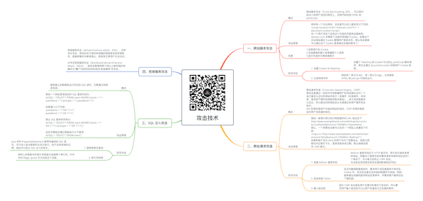

# 攻击技术

关注下方微信公众号，回复【思维导图】即可获得高清原图：

## 一、跨站脚本攻击

### 概念

- 跨站脚本攻击（Cross-Site Scripting, XSS），可以将代码注入到用户浏览的网页上，这种代码包括 HTML 和 JavaScript。

### 攻击原理

- 例如有一个论坛网站，攻击者可以在上面发布以下内容：

另一个用户浏览了含有这个内容的页面将会跳转到 domain.com 并携带了当前作用域的 Cookie。如果这个论坛网站通过 Cookie 管理用户登录状态，那么攻击者就可以通过这个 Cookie 登录被攻击者的账号了。

### 危害

- 1.窃取用户的 Cookie
2.伪造虚假的输入表单骗取个人信息
3.显示伪造的文章或者图片

### 防范手段

- 1. 设置 Cookie 为 HttpOnly

	- 设置了 HttpOnly 的 Cookie 可以防止 JavaScript 脚本调用，就无法通过 document.cookie 获取用户 Cookie 信息。

- 2. 过滤特殊字符

	- 例如将 < 转义为 &lt;，将 > 转义为 &gt;，从而避免 HTML 和 Jascript 代码的运行。

## 二、跨站请求伪造

### 概念

- 跨站请求伪造（Cross-site request forgery，CSRF），是攻击者通过一些技术手段欺骗用户的浏览器去访问一个自己曾经认证过的网站并执行一些操作（如发邮件，发消息，甚至财产操作如转账和购买商品）。由于浏览器曾经认证过，所以被访问的网站会认为是真正的用户操作而去执行。
XSS 利用的是用户对指定网站的信任，CSRF 利用的是网站对用户浏览器的信任。

### 攻击原理

- 假如一家银行用以执行转账操作的 URL 地址如下：
http://www.examplebank.com/withdraw?account=AccoutName&amount=1000&for=PayeeName
那么，一个恶意攻击者可以在另一个网站上放置如下代码：

如果有账户名为 Alice 的用户访问了恶意站点，而她之前刚访问过银行不久，登录信息尚未过期，那么她就会损失 1000 美元。

### 防范手段

- 1. 检查 Referer 首部字段

	- Referer 首部字段位于 HTTP 报文中，用于标识请求来源的地址。检查这个首部字段并要求请求来源的地址在同一个域名下，可以极大的防止 CSRF 攻击。
无法保证浏览器没有安全漏洞影响到此字段。

- 2. 添加校验 Token

	- 在访问敏感数据请求时，要求用户浏览器提供不保存在 Cookie 中，并且攻击者无法伪造的数据作为校验。例如服务器生成随机数并附加在表单中，并要求客户端传回这个随机数。

- 3. 输入验证码

	- 因为 CSRF 攻击是在用户无意识的情况下发生的，所以要求用户输入验证码可以让用户知道自己正在做的操作。

## 三、SQL 注入攻击

### 概念

- 服务器上的数据库运行非法的 SQL 语句，主要通过拼接来完成。

### 攻击原理

- 例如一个网站登录验证的 SQL 查询代码为：
strSQL = "SELECT * FROM users WHERE (name = '" + userName + "') and (pw = '"+ passWord +"');"

如果填入以下内容：
userName = "1' OR '1'='1";
passWord = "1' OR '1'='1";

那么 SQL 查询字符串为：
strSQL = "SELECT * FROM users WHERE (name = '1' OR '1'='1') and (pw = '1' OR '1'='1');"

此时无需验证通过就能执行以下查询：
strSQL = "SELECT * FROM users;"

### 防范手段

- 1. 使用参数化查询

	- Java 中的 PreparedStatement 是预先编译的 SQL 语句，可以传入适当参数并且多次执行。由于没有拼接的过程，因此可以防止 SQL 注入的发生。

- 2. 单引号转换

	- 将传入的参数中的单引号转换为连续两个单引号，PHP 中的 Magic quote 可以完成这个功能。

## 四、拒绝服务攻击

### 拒绝服务攻击（denial-of-service attack，DoS），亦称洪水攻击，其目的在于使目标电脑的网络或系统资源耗尽，使服务暂时中断或停止，导致其正常用户无法访问。

分布式拒绝服务攻击（distributed denial-of-service attack，DDoS），指攻击者使用两个或以上被攻陷的电脑作为“僵尸”向特定的目标发动“拒绝服务”式攻击。

*XMind: ZEN - Trial Version*