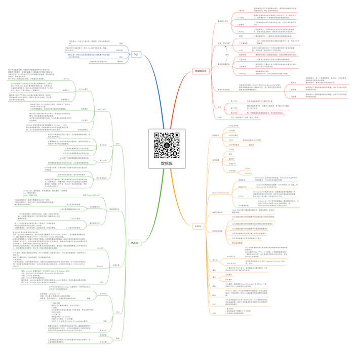

# 数据库

关注下方微信公众号，回复【思维导图】即可获得高清原图：

## 数据库系统

### 事务四大特性

- 1. 原子性

	- 事务被视为不可分割的最小单元，事务的所有操作要么全部提交成功，要么全部失败回滚。

- 2.一致性

	- 数据库在事务执行前后都保持一致性状态。在一致性状态下，所有事务对一个数据的读取结果都是相同的。

- 3.隔离性

	- 一个事务所做的修改在最终提交以前，对其它事务是不可见的。

- 4.持久性

	- 一旦事务提交，则其所做的修改将会永远保存到数据库中。即使系统发生崩溃，事务执行的结果也不能丢失。

### 并发一致性问题

- 脏读

	- 一个事务读取另外一个事务还没有提交的数据叫脏读。

- 不可重复度

	- 在一个事务中前后两次读取的结果并不一致，导致了不可重复读。

- 幻读

	- 在两个连续的查询之间一个并发的事务修改了查询的数据集，导致这两个查询返回了不同的结果。

### 事务的隔离级别

- 未提交读

	- 事务中的修改，即使没有提交，对其它事务也是可见的。

- 已提交读

	- 一个事务只能读取已经提交的事务所做的修改。

- 可重复读

	- 保证在同一个事务中多次读取同样数据的结果是一样的。
MySQL默认的隔离级别

- 可串行化

	- 强制事务串行执行。
需要加锁实现，而其它隔离级别通常不需要。

### 多版本并发控制

- 多版本并发控制（MVCC）是 MySQL 的 InnoDB 存储引擎实现隔离级别的一种具体方式，用于实现已提交读和可重复读这两种隔离级别。

	- 版本号

		- 系统版本号：是一个递增的数字，每开始一个新的事务，系统版本号就会自动递增。
事务版本号：事务开始时的系统版本号。

	- 快照读

		- 使用 MVCC 读取的是快照中的数据，这样可以减少加锁所带来的开销。

	- 当前读

		- 使用 MVCC 读取的是快照中的数据，这样可以减少加锁所带来的开销。

### 范式

- 第一范式

	- 所有字段值都是不可分解的原子值

- 第二范式

	- 确保数据库表中每一列都和主键相关，而不能只与主键的某一部分相关。

- 第三范式

	- 每一列数据都和主键直接相关，而不能间接相关。

### ER图

- 有三个组成部分：实体、属性、联系。

## Redis

### 数据类型

- String字符串
- List列表
- Set无序集合
- HASH

	- 链地址法解决HASH冲突

- ZSET有序集合

	- 跳跃表

### 使用场景

- 计数器
- 缓存
- 查找表
- 消息队列
- 分布式锁

	- SETNX
	- RedLock

### Redis 与 Memcached

- 数据类型

	- Memcached 仅支持字符串类型，而 Redis 支持五种不同的数据类型，可以更灵活地解决问题。

- 数据持久化

	- Redis 支持两种持久化策略：RDB 快照和 AOF 日志，而 Memcached 不支持持久化。

- 分布式

	- Memcached 不支持分布式，只能通过在客户端使用一致性哈希来实现分布式存储，这种方式在存储和查询时都需要先在客户端计算一次数据所在的节点。

- 内存管理机制

	- 在 Redis 中，并不是所有数据都一直存储在内存中，可以将一些很久没用的 value 交换到磁盘，而 Memcached 的数据则会一直在内存中。

### 键的过期时间

- Redis 可以为每个键设置过期时间，当键过期时，会自动删除该键。

### 数据淘汰策略

- 从已设置过期时间的数据集中挑选最近最少使用的数据淘汰
- 从已设置过期时间的数据集中挑选将要过期的数据淘汰
- 从已设置过期时间的数据集中任意选择数据淘汰
- 从所有数据集中挑选最近最少使用的数据淘汰
- 从所有数据集中任意选择数据进行淘汰
- 禁止驱逐数据

### 持久化

- RDB持久化

	- 可以将快照复制到其它服务器从而创建具有相同数据的服务器副本。
Redis调用fork()，产生一个子进程。子进程把数据写到一个临时的RDB文件。当子进程写完新的RDB文件后，把旧的RDB文件替换掉。

- AOF 持久化

	- 将写命令添加到 AOF 文件（Append Only File）的末尾。实时。

### 事务

- 一个事务包含了多个命令，服务器在执行事务期间，不会改去执行其它客户端的命令请求。

### 事件

- 文件事件
- 时间事件

### 复制

- 主从复制：通过使用 slaveof host port 命令来让一个服务器成为另一个服务器的从服务器。

### 哨兵

- Sentinel（哨兵）可以监听集群中的服务器，并在主服务器进入下线状态时，自动从从服务器中选举出新的主服务器。

### 分片

- 分片是将数据划分为多个部分的方法，可以将数据存储到多台机器里面，这种方法在解决某些问题时可以获得线性级别的性能提升。

### 优势

- 1.基于内存
2.单线程避免了频繁的上下文切换
3.非阻塞IO多路复用模型

## MySQL

### 索引

- MySQL索引

	- B+Tree索引

		- B+Tree

			- 是一种多路搜索树，M路的B树最多能拥有M个孩子节点。
数据库中的索引一般是在磁盘上，数据量大的情况可能无法一次装入内存，B+树的设计可以允许数据分批加载，同时树的高度较低，提高查找效率。
叶子节点之间通过指针连接，方便查询多条数据。

		- 聚簇索引

			- InnoDB 的 B+Tree 索引分为主索引和辅助索引。主索引的叶子节点 data 域记录着完整的数据记录，这种索引方式被称为聚簇索引。因为无法把数据行存放在两个不同的地方，所以一个表只能有一个聚簇索引。

		- 非聚簇索引

			- 辅助索引的叶子节点的 data 域记录着主键的值，因此在使用辅助索引进行查找时，需要先查找到主键值，然后再到主索引中进行查找。

	- 哈希索引

		- 哈希索引能以 O(1) 时间进行查找，但是失去了有序性：
无法用于排序与分组；
只支持精确查找，无法用于部分查找和范围查找。

	- 全文索引

		- MyISAM 存储引擎支持全文索引，用于查找文本中的关键词，而不是直接比较是否相等。
全文索引使用倒排索引实现，它记录着关键词到其所在文档的映射。

	- 空间数据索引

		- MyISAM 存储引擎支持空间数据索引（R-Tree），可以用于地理数据存储。空间数据索引会从所有维度来索引数据，可以有效地使用任意维度来进行组合查询。

- 索引优化

	- 索引列不能是表达式的一部分，也不能是函数的参数，否则无法使用索引。
	- 在需要使用多个列作为条件进行查询时，使用多列索引比使用多个单列索引性能更好。
	- 让选择性最强的索引列放在前面。
	- 索引包含所有需要查询的字段的值。

- 索引优点

	- 大大减少了服务器需要扫描的数据行数。
	- 帮助服务器避免进行排序和分组，以及避免创建临时表。

- 索引使用条件

	- 对于非常小的表、大部分情况下简单的全表扫描比建立索引更高效；
	- 对于中到大型的表，索引就非常有效；
	- 但是对于特大型的表，建立和维护索引的代价将会随之增长。这种情况下，需要用到一种技术可以直接区分出需要查询的一组数据，而不是一条记录一条记录地匹配，例如可以使用分区技术。

### 查询性能优化

- 使用 Explain 进行分析

	- select_type : 查询类型，有简单查询、联合查询、子查询等
key : 使用的索引
rows : 扫描的行数

- 优化数据访问

	- 1. 减少请求的数据量

		- 只返回必要的列：最好不要使用 SELECT * 语句。
只返回必要的行：使用 LIMIT 语句来限制返回的数据。
缓存重复查询的数据

	- 2. 减少服务器端扫描的行数

- 重构查询方式

	- 1. 切分大查询

		- 一个大查询如果一次性执行的话，可能一次锁住很多数据、占满整个事务日志、耗尽系统资源、阻塞很多小的但重要的查询。

	- 2. 分解大连接查询

		- 将一个大连接查询分解成对每一个表进行一次单表查询，然后在应用程序中进行关联。好处有：
让缓存更高效。减少锁竞争。应用层连接，扩展性更高。

### 存储引擎

- InnoDB

	- 是 MySQL 默认的事务型存储引擎。
实现了四个标准的隔离级别，默认级别是可重复读（REPEATABLE READ）。在可重复读隔离级别下，通过多版本并发控制（MVCC）+ Next-Key Locking 锁防止幻读。
主索引是聚簇索引，在索引中保存了数据，从而避免直接读取磁盘，因此对查询性能有很大的提升。
内部做了很多优化，包括从磁盘读取数据时采用的可预测性读、能够加快读操作并且自动创建的自适应哈希索引、能够加速插入操作的插入缓冲区等。
支持真正的在线热备份。其它存储引擎不支持在线热备份，要获取一致性视图需要停止对所有表的写入，而在读写混合场景中，停止写入可能也意味着停止读取。

-  MyISAM

	- 设计简单，数据以紧密格式存储。对于只读数据，或者表比较小、可以容忍修复操作，则依然可以使用它。
提供了大量的特性，包括压缩表、空间数据索引等。
不支持事务。
不支持行级锁，只能对整张表加锁，读取时会对需要读到的所有表加共享锁，写入时则对表加排它锁。但在表有读取操作的同时，也可以往表中插入新的记录，这被称为并发插入（CONCURRENT INSERT）。

- 比较

	- 事务：InnoDB 是事务型的，可以使用 Commit 和 Rollback 语句。
并发：MyISAM 只支持表级锁，而 InnoDB 还支持行级锁。
外键：InnoDB 支持外键。
备份：InnoDB 支持在线热备份。
崩溃恢复：MyISAM 崩溃后发生损坏的概率比 InnoDB 高很多，而且恢复的速度也更慢。
其它特性：MyISAM 支持压缩表和空间数据索引。

### 切分

- 水平切分

	- 水平切分又称为 Sharding，它是将同一个表中的记录拆分到多个结构相同的表中。
	- 策略

		- 哈希取模：hash(key) % N；
范围：可以是 ID 范围也可以是时间范围；
映射表：使用单独的一个数据库来存储映射关系。

- 问题

	- 1. 事务问题
使用分布式事务来解决，比如 XA 接口。
2. 连接
可以将原来的连接分解成多个单表查询，然后在用户程序中进行连接。
3. ID 唯一性
使用全局唯一 ID（GUID）
为每个分片指定一个 ID 范围
分布式 ID 生成器 (如 Twitter 的 Snowflake 算法)

- 垂直切分

	- 垂直切分是将一张表按列切分成多个表，通常是按照列的关系密集程度进行切分，也可以利用垂直切分将经常被使用的列和不经常被使用的列切分到不同的表中。

### 复制

- 主从复制
- 读写分离

	- 主服务器处理写操作以及实时性要求比较高的读操作，而从服务器处理读操作。

## SQL

### 视图

- 视图是从一个或几个基本表（或视图）中导出的虚拟的表。

### 存储过程

- 存储过程可以看成是对一系列 SQL 操作的批处理。预编译SQL语句。

### 游标

- 实际上是一种能从包含多条数据记录的结果集中每次提取一条记录的机制。

### 触发器

- 由事件触发的存储过程。

*XMind: ZEN - Trial Version*