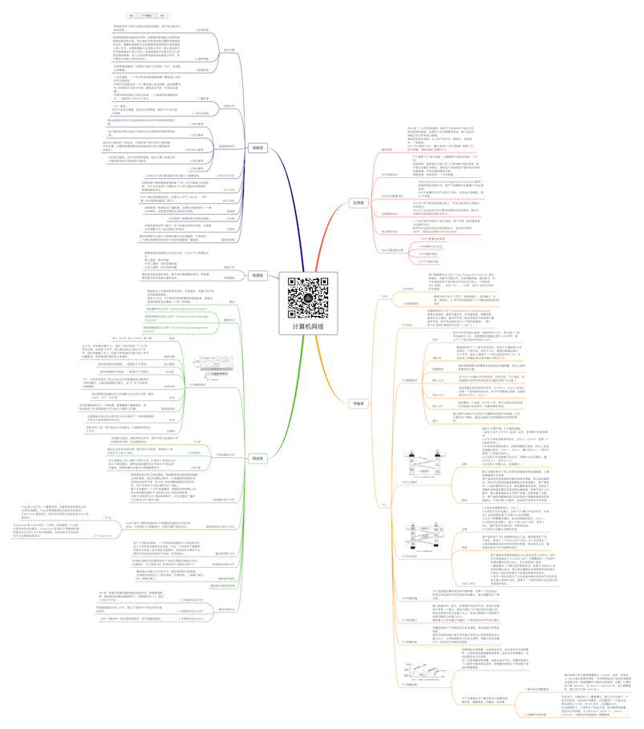

# 计算机网络

关注下方微信公众号，回复【思维导图】即可获得高清原图：

## 应用层

### 域名系统

- DNS 是一个分布式数据库，提供了主机名和 IP 地址之间相互转换的服务。这里的分布式数据库是指，每个站点只保留它自己的那部分数据。
域名具有层次结构，从上到下依次为：根域名、顶级域名、二级域名。
DNS 可以使用 UDP （最大支持512字节数据）或者 TCP 进行传输，使用的端口号都为 53。

### 文件传输协议

- FTP 使用 TCP 进行连接，它需要两个连接来传送一个文件：
控制连接：服务器打开端口号 21 等待客户端的连接，客户端主动建立连接后，使用这个连接将客户端的命令传送给服务器，并传回服务器的应答。
数据连接：用来传送一个文件数据。

### 动态主机配置协议

- DHCP (Dynamic Host Configuration Protocol) 提供了即插即用的连网方式，用户不再需要手动配置 IP 地址等信息。
DHCP 配置的内容不仅是 IP 地址，还包括子网掩码、网关 IP 地址。

### 远程登陆协议

- TELNET 用于登录到远程主机上，并且远程主机上的输出也会返回。
TELNET 可以适应许多计算机和操作系统的差异，例如不同操作系统系统的换行符定义。

### 电子邮件协议

- 一个电子邮件系统由三部分组成：用户代理、邮件服务器以及邮件协议。
邮件协议包含发送协议和读取协议，发送协议常用 SMTP，读取协议常用 POP3 和 IMAP。

### Web页面请求过程

-  1.DHCP配置主机信息
- 2.ARP解析MAC协议
- 3.DNS解析域名
- 4.HTTP请求页面

## 传输层

### UDP

- UDP特点

	- 用户数据报协议 UDP（User Datagram Protocol）是无连接的，尽最大可能交付，没有拥塞控制，面向报文（对于应用程序传下来的报文不合并也不拆分，只是添加 UDP 首部），支持一对一、一对多、多对一和多对多的交互通信。

- UDP首部格式

	- 首部字段只有 8 个字节，包括源端口、目的端口、长度、检验和。12 字节的伪首部是为了计算检验和临时添加的。

### TCP

- TCP特点

	- 传输控制协议 TCP（Transmission Control Protocol）是面向连接的，提供可靠交付，有流量控制，拥塞控制，提供全双工通信，面向字节流（把应用层传下来的报文看成字节流，把字节流组织成大小不等的数据块），每一条 TCP 连接只能是点对点的（一对一）。

- TCP首部格式

	- 序号

		- 用于对字节流进行编号，例如序号为 301，表示第一个字节的编号为 301，如果携带的数据长度为 100 字节，那么下一个报文段的序号应为 401。

	-  确认号

		- 期望收到的下一个报文段的序号。例如 B 正确收到 A 发送来的一个报文段，序号为 501，携带的数据长度为 200 字节，因此 B 期望下一个报文段的序号为 701，B 发送给 A 的确认报文段中确认号就为 701。

	- 数据偏移

		- 指的是数据部分距离报文段起始处的偏移量，实际上指的是首部的长度。

	- 确认 ACK

		- 当 ACK=1 时确认号字段有效，否则无效。TCP 规定，在连接建立后所有传送的报文段都必须把 ACK 置 1。

	- 同步 SYN

		- 在连接建立时用来同步序号。当 SYN=1，ACK=0 时表示这是一个连接请求报文段。若对方同意建立连接，则响应报文中 SYN=1，ACK=1。

	- 终止 FIN

		- 用来释放一个连接，当 FIN=1 时，表示此报文段的发送方的数据已发送完毕，并要求释放连接。

	- 窗口

		- 窗口值作为接收方让发送方设置其发送窗口的依据。之所以要有这个限制，是因为接收方的数据缓存空间是有限的。

- TCP三次握手

	- 过程

		- 假设 A 为客户端，B 为服务器端。
1.首先 B 处于 LISTEN（监听）状态，等待客户的连接请求。
2.A 向 B 发送连接请求报文，SYN=1，ACK=0，选择一个初始的序号 x。
3.B 收到连接请求报文，如果同意建立连接，则向 A 发送连接确认报文，SYN=1，ACK=1，确认号为 x+1，同时也选择一个初始的序号 y。
4.A 收到 B 的连接确认报文后，还要向 B 发出确认，确认号为 y+1，序号为 x+1。
5.B 收到 A 的确认后，连接建立。

	- 原因

		- 第三次握手是为了防止失效的连接请求到达服务器，让服务器错误打开连接。
客户端发送的连接请求如果在网络中滞留，那么就会隔很长一段时间才能收到服务器端发回的连接确认。客户端等待一个超时重传时间之后，就会重新请求连接。但是这个滞留的连接请求最后还是会到达服务器，如果不进行三次握手，那么服务器就会打开两个连接。如果有第三次握手，客户端会忽略服务器之后发送的对滞留连接请求的连接确认，不进行第三次握手，因此就不会再次打开连接。

- TCP四次挥手

	- 过程

		- 1.A 发送连接释放报文，FIN=1。
2.B 收到之后发出确认，此时 TCP 属于半关闭状态，B 能向 A 发送数据但是 A 不能向 B 发送数据。
3.当 B 不再需要连接时，发送连接释放报文，FIN=1。
4.A 收到后发出确认，进入 TIME-WAIT 状态，等待 2 MSL（最大报文存活时间）后释放连接。
5.B 收到 A 的确认后释放连接。

	- 原因

		- 客户端发送了 FIN 连接释放报文之后，服务器收到了这个报文，就进入了 CLOSE-WAIT 状态。这个状态是为了让服务器端发送还未传送完毕的数据，传送完毕之后，服务器会发送 FIN 连接释放报文。

	- TIME_WAIT

		- 客户端接收到服务器端的 FIN 报文后进入此状态，此时并不是直接进入 CLOSED 状态，还需要等待一个时间计时器设置的时间 2MSL。这么做有两个理由：
1.确保最后一个确认报文能够到达。如果 B 没收到 A 发送来的确认报文，那么就会重新发送连接释放请求报文，A 等待一段时间就是为了处理这种情况的发生。
2.等待一段时间是为了让本连接持续时间内所产生的所有报文都从网络中消失，使得下一个新的连接不会出现旧的连接请求报文。

- TCP可靠传输

	- TCP 使用超时重传来实现可靠传输：如果一个已经发送的报文段在超时时间内没有收到确认，那么就重传这个报文段。

- TCP滑动窗口

	- 窗口是缓存的一部分，用来暂时存放字节流。发送方和接收方各有一个窗口，接收方通过 TCP 报文段中的窗口字段告诉发送方自己的窗口大小，发送方根据这个值和其它信息设置自己的窗口大小。
接收窗口只会对窗口内最后一个按序到达的字节进行确认

- TCP流量控制

	- 流量控制是为了控制发送方发送速率，保证接收方来得及接收。
接收方发送的确认报文中的窗口字段可以用来控制发送方窗口大小，从而影响发送方的发送速率。将窗口字段设置为 0，则发送方不能发送数据。

- TCP拥塞控制

	- 如果网络出现拥塞，分组将会丢失，此时发送方会继续重传，从而导致网络拥塞程度更高。因此当出现拥塞时，应当控制发送方的速率。
这一点和流量控制很像，但是出发点不同。流量控制是为了让接收方能来得及接收，而拥塞控制是为了降低整个网络的拥塞程度。
	- TCP 主要通过四个算法来进行拥塞控制：
慢开始、拥塞避免、快重传、快恢复。

		- 1.慢开始与拥塞避免

			- 慢开始每个轮次都将拥塞窗口（ cwnd） 加倍，这样会让 cwnd 增长速度非常快，从而使得发送方发送的速度增长速度过快，网络拥塞的可能性也就更高。设置一个慢开始门限 ssthresh，当 cwnd >= ssthresh 时，进入拥塞避免，每个轮次只将 cwnd 加 1。

		- 2.快重传与快恢复

			- 在发送方，如果收到三个重复确认，那么可以知道下一个报文段丢失，此时执行快重传，立即重传下一个报文段。例如收到三个 M2，则 M3 丢失，立即重传 M3。
在这种情况下，只是丢失个别报文段，而不是网络拥塞。因此执行快恢复，令 ssthresh = cwnd / 2 ，cwnd = ssthresh，注意到此时直接进入拥塞避免。

## 网络层

### 概述

- 网络层向上只提供简单灵活的、无连接的、尽最大努力交互的数据报服务。
使用 IP 协议，可以把异构的物理网络连接起来，使得在网络层看起来好像是一个统一的网络。

### 配套协议

- 地址解析协议 ARP（Address Resolution Protocol）
- 网际控制报文协议 ICMP（Internet Control Message Protocol）
- 网际组管理协议 IGMP（Internet Group Management Protocol）

### IP 数据报格式

- 版本

	- 有 4（IPv4）和 6（IPv6）两个值；

- 首部长度

	- 占 4 位，因此最大值为 15。值为 1 表示的是 1 个 32 位字的长度，也就是 4 字节。因为固定部分长度为 20 字节，因此该值最小为 5。如果可选字段的长度不是 4 字节的整数倍，就用尾部的填充部分来填充。

- 区分服务

	- 用来获得更好的服务，一般情况下不使用。

- 总长度 

	- 用来获得更好的服务，一般情况下不使用。

- 生存时间

	- TTL，它的存在是为了防止无法交付的数据报在互联网中不断兜圈子。以路由器跳数为单位，当 TTL 为 0 时就丢弃数据报。

- 协议

	- 指出携带的数据应该上交给哪个协议进行处理，例如 ICMP、TCP、UDP 等。

- 首部检验和

	- 因为数据报每经过一个路由器，都要重新计算检验和，因此检验和不包含数据部分可以减少计算的工作量。

- 标识

	- 在数据报长度过长从而发生分片的情况下，相同数据报的不同分片具有相同的标识符。

- 片偏移

	- 和标识符一起，用于发生分片的情况。片偏移的单位为 8 字节。

### IP地址编址方式

- 1.分类

	- 由两部分组成，网络号和主机号，其中不同分类具有不同的网络号长度，并且是固定的。

- 2.子网划分

	- 通过在主机号字段中拿一部分作为子网号，把两级 IP 地址划分为三级 IP 地址。

- 3.无分类

	- 无分类编址 CIDR 消除了传统 A 类、B 类和 C 类地址以及划分子网的概念，使用网络前缀和主机号来对 IP 地址进行编码，网络前缀的长度可以根据需要变化。

### 地址解析协议 ARP

- 网络层实现主机之间的通信，而链路层实现具体每段链路之间的通信。因此在通信过程中，IP 数据报的源地址和目的地址始终不变，而 MAC 地址随着链路的改变而改变。ARP 实现由 IP 地址得到 MAC 地址。
每个主机都有一个 ARP 高速缓存，里面有本局域网上的各主机和路由器的 IP 地址到 MAC 地址的映射表。
没有 IP 地址到 MAC 地址的映射时，主机会通过广播的方式发送 ARP 请求分组。

### 网际控制报文协议 ICMP

- ICMP 是为了更有效地转发 IP 数据报和提高交付成功的机会。它封装在 IP 数据报中，但是不属于高层协议。

	- 1.Ping

		- Ping 是 ICMP 的一个重要应用，主要用来测试两台主机之间的连通性。Ping 的原理是通过向目的主机发送 ICMP Echo 请求报文，目的主机收到之后会发送 Echo 回答报文。

	- 2. Traceroute

		- Traceroute 是 ICMP 的另一个应用，用来跟踪一个分组从源点到终点的路径。Traceroute 发送的 IP 数据报封装的是无法交付的 UDP 用户数据报，并由目的主机发送终点不可达差错报告报文。

### 虚拟专用网 VPN

- 由于 IP 地址的紧缺，一个机构能申请到的 IP 地址数往往远小于本机构所拥有的主机数。并且一个机构并不需要把所有的主机接入到外部的互联网中，机构内的计算机可以使用仅在本机构有效的 IP 地址（专用地址）。

### 网络地址转换 NAT

- 专用网内部的主机使用本地 IP 地址又想和互联网上的主机通信时，可以使用 NAT 来将本地 IP 转换为全球 IP。

### 路由器的结构

- 路由器从功能上可以划分为：路由选择和分组转发。
分组转发结构由三个部分组成：交换结构、一组输入端口和一组输出端口。

### 路由器分组转发流程

### 路由选择协议

- 1. 内部网关协议 RIP

	- RIP 是一种基于距离向量的路由选择协议。距离是指跳数，直接相连的路由器跳数为 1。跳数最多为 15，超过 15 表示不可达。

- 2. 内部网关协议 OSPF

	- 开放最短路径优先 OSPF，是为了克服 RIP 的缺点而开发出来的。

- 3. 外部网关协议 BGP

	- BGP 只能寻找一条比较好的路由，而不是最佳路由。

## 物理层

### 通信方式

- 根据信息在传输线上的传送方向，分为以下三种通信方式：
单工通信：单向传输
半双工通信：双向交替传输
全双工通信：双向同时传输

### 带通调制

- 模拟信号是连续的信号，数字信号是离散的信号。带通调制把数字信号转换为模拟信号。

## 链路层

### 基本问题

- 1.封装成帧

	- 将网络层传下来的分组添加首部和尾部，用于标记帧的开始和结束。

- 2. 透明传输

	- 帧使用首部和尾部进行定界，如果帧的数据部分含有和首部尾部相同的内容，那么帧的开始和结束位置就会被错误的判定。需要在数据部分出现首部尾部相同的内容前面插入转义字符。如果数据部分出现转义字符，那么就在转义字符前面再加个转义字符。在接收端进行处理之后可以还原出原始数据。这个过程透明传输的内容是转义字符，用户察觉不到转义字符的存在。

- 3.差错检测

	- 目前数据链路层广泛使用了循环冗余检验（CRC）来检查比特差错。

### 信道分类

- 1.广播信道

	- 一对多通信，一个节点发送的数据能够被广播信道上所有的节点接收到。
所有的节点都在同一个广播信道上发送数据，因此需要有专门的控制方法进行协调，避免发生冲突（冲突也叫碰撞）。
主要有两种控制方法进行协调，一个是使用信道复用技术，一是使用 CSMA/CD 协议。

- 2. 点对点信道

	- 一对一通信。
因为不会发生碰撞，因此也比较简单，使用 PPP 协议进行控制。

### 信道复用技术

- 1. 频分复用

	- 频分复用的所有主机在相同的时间占用不同的频率带宽资源。

- 2.时分复用

	- 时分复用的所有主机在不同的时间占用相同的频率带宽资源。

- 3.统计时分复用

	- 是对时分复用的一种改进，不固定每个用户在时分复用帧中的位置，只要有数据就集中起来组成统计时分复用帧然后发送。

- 4.波分复用

	- 光的频分复用。由于光的频率很高，因此习惯上用波长而不是频率来表示所使用的光载波。

- 5.码分复用

### CSMA/CD 协议

- CSMA/CD 表示载波监听多点接入 / 碰撞检测。

### PPP 协议

- 互联网用户通常需要连接到某个 ISP 之后才能接入到互联网，PPP 协议是用户计算机和 ISP 进行通信时所使用的数据链路层协议。

### MAC 地址

- MAC 地址是链路层地址，长度为 6 字节（48 位），用于唯一标识网络适配器（网卡）。

### 局域网

- 局域网是一种典型的广播信道，主要特点是网络为一个单位所拥有，且地理范围和站点数目均有限。

### 以太网

- 以太网是一种星型拓扑结构局域网。

### 交换机

- 交换机具有自学习能力，学习的是交换表的内容，交换表中存储着 MAC 地址到接口的映射。

### 虚拟局域网

- 虚拟局域网可以建立与物理位置无关的逻辑组，只有在同一个虚拟局域网中的成员才会收到链路层广播信息。

*XMind: ZEN - Trial Version*