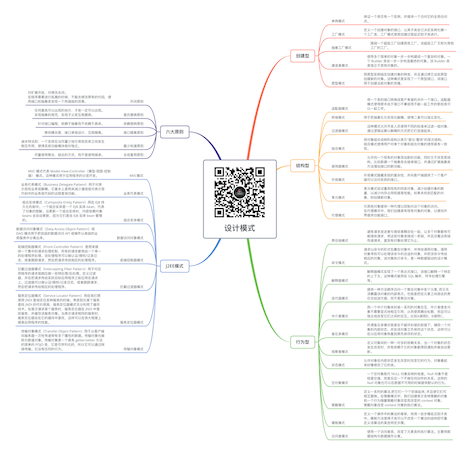

# 设计模式

关注下方微信公众号，回复【思维导图】即可获得高清原图：

## 创建型

### 单例模式

- 保证一个类仅有一个实例，并提供一个访问它的全局访问点。

### 工厂模式

- 定义一个创建对象的接口，让其子类自己决定实例化哪一个工厂类，工厂模式使其创建过程延迟到子类进行。

### 抽象工厂模式

- 围绕一个超级工厂创建其他工厂。该超级工厂又称为其他工厂的工厂。

### 建造者模式

- 使用多个简单的对象一步一步构建成一个复杂的对象。一个 Builder 类会一步一步构造最终的对象。该 Builder 类是独立于其他对象的。

### 原型模式

- 用原型实例指定创建对象的种类，并且通过拷贝这些原型创建新的对象。这种模式是实现了一个原型接口，该接口用于创建当前对象的克隆。

## 结构型

### 适配器模式

- 将一个类的接口转换成客户希望的另外一个接口。适配器模式使得原本由于接口不兼容而不能一起工作的那些类可以一起工作。

### 桥接模式

- 用于把抽象化与实现化解耦，使得二者可以独立变化。

### 过滤器模式

- 这种模式允许开发人员使用不同的标准来过滤一组对象，通过逻辑运算以解耦的方式把它们连接起来。

### 组合模式

- 将对象组合成树形结构以表示"部分-整体"的层次结构。组合模式使得用户对单个对象和组合对象的使用具有一致性。

### 装饰器模式

- 允许向一个现有的对象添加新的功能，同时又不改变其结构。比如新建一个抽象类去继承接口，并通过扩展抽象类方法增加接口的新功能。

### 外观模式

- 外观模式隐藏系统的复杂性，并向客户端提供了一个客户端可以访问系统的接口。

### 享元模式

- 享元模式尝试重用现有的同类对象，减少创建对象的数量，以减少内存占用和提高性能。如果未找到匹配的对象，则创建新对象。

### 代理模式

- 为其他对象提供一种代理以控制对这个对象的访问。
在代理模式中，我们创建具有现有对象的对象，以便向外界提供功能接口。

## 行为型

### 责任链模式

- 避免请求发送者与接收者耦合在一起，让多个对象都有可能接收请求，将这些对象连接成一条链，并且沿着这条链传递请求，直到有对象处理它为止。

### 命令模式

- 请求以命令的形式包裹在对象中，并传给调用对象。调用对象寻找可以处理该命令的合适的对象，并把该命令传给相应的对象，该对象执行命令。是一种数据驱动的设计模式。

### 解释器模式

- 解释器模式实现了一个表达式接口，该接口解释一个特定的上下文。这种模式被用在 SQL 解析、符号处理引擎等。

### 迭代器模式

- 提供一种方法顺序访问一个聚合对象中各个元素, 而又无须暴露该对象的内部表示。也就是把在元素之间游走的责任交给迭代器，而不是聚合对象。

### 中介者模式

- 用一个中介对象来封装一系列的对象交互，中介者使各对象不需要显式地相互引用，从而使其耦合松散，而且可以独立地改变它们之间的交互。比如A调用B，B调用C。

### 备忘录模式

- 所谓备忘录模式就是在不破坏封装的前提下，捕获一个对象的内部状态，并在该对象之外保存这个状态，这样可以在以后将对象恢复到原先保存的状态。

### 观察者模式

- 定义对象间的一种一对多的依赖关系，当一个对象的状态发生改变时，所有依赖于它的对象都得到通知并被自动更新。

### 状态模式

- 允许对象在内部状态发生改变时改变它的行为，对象看起来好像修改了它的类。

### 空对象模式

- 一个空对象取代 NULL 对象实例的检查。Null 对象不是检查空值，而是反应一个不做任何动作的关系。这样的 Null 对象也可以在数据不可用的时候提供默认的行为。

### 策略模式

- 定义一系列的算法,把它们一个个封装起来, 并且使它们可相互替换。在策略模式中，我们创建表示各种策略的对象和一个行为随着策略对象改变而改变的 context 对象。策略对象改变 context 对象的执行算法。

### 模板模式

- 定义一个操作中的算法的骨架，而将一些步骤延迟到子类中。模板方法使得子类可以不改变一个算法的结构即可重定义该算法的某些特定步骤。

### 访问者模式

- 使用一个访问者类，改变了元素类的执行算法。主要将数据结构与数据操作分离。

## J2EE模式

### MVC模式

- MVC 模式代表 Model-View-Controller（模型-视图-控制器） 模式。这种模式用于应用程序的分层开发。

### 业务代表模式

- 业务代表模式（Business Delegate Pattern）用于对表示层和业务层解耦。它基本上是用来减少通信或对表示层代码中的业务层代码的远程查询功能。

### 组合实体模式

- 组合实体模式（Composite Entity Pattern）用在 EJB 持久化机制中。一个组合实体是一个 EJB 实体 bean，代表了对象的图解。当更新一个组合实体时，内部依赖对象 beans 会自动更新，因为它们是由 EJB 实体 bean 管理的。

### 数据访问对象模式

- 数据访问对象模式（Data Access Object Pattern）或 DAO 模式用于把低级的数据访问 API 或操作从高级的业务服务中分离出来。

### 前端控制器模式

- 前端控制器模式（Front Controller Pattern）是用来提供一个集中的请求处理机制，所有的请求都将由一个单一的处理程序处理。该处理程序可以做认证/授权/记录日志，或者跟踪请求，然后把请求传给相应的处理程序。

### 拦截过滤器模式

- 拦截过滤器模式（Intercepting Filter Pattern）用于对应用程序的请求或响应做一些预处理/后处理。定义过滤器，并在把请求传给实际目标应用程序之前应用在请求上。过滤器可以做认证/授权/记录日志，或者跟踪请求，然后把请求传给相应的处理程序。

### 服务定位器模式

- 服务定位器模式（Service Locator Pattern）用在我们想使用 JNDI 查询定位各种服务的时候。考虑到为某个服务查找 JNDI 的代价很高，服务定位器模式充分利用了缓存技术。在首次请求某个服务时，服务定位器在 JNDI 中查找服务，并缓存该服务对象。当再次请求相同的服务时，服务定位器会在它的缓存中查找，这样可以在很大程度上提高应用程序的性能。

### 传输对象模式

- 传输对象模式（Transfer Object Pattern）用于从客户端向服务器一次性传递带有多个属性的数据。传输对象也被称为数值对象。传输对象是一个具有 getter/setter 方法的简单的 POJO 类，它是可序列化的，所以它可以通过网络传输。它没有任何的行为。

## 六大原则

### 开闭原则

- 对扩展开放，对修改关闭。
在程序需要进行拓展的时候，不能去修改原有的代码，使用接口和抽象类实现一个热插拔的效果。

### 里氏替换原则

- 任何基类可以出现的地方，子类一定可以出现。
实现抽象的规范，实现子父类互相替换。

### 依赖倒转原则

- 针对接口编程，依赖于抽象而不依赖于具体。

### 接口隔离原则

- 降低耦合度，接口单独设计，互相隔离。

### 最少知道原则

- 迪米特法则：一个实体应当尽量少地与其他实体之间发生相互作用，使得系统功能模块相对独立。

### 合成复用原则

- 尽量使用聚合、组合的方式，而不是使用继承。

*XMind: ZEN - Trial Version*