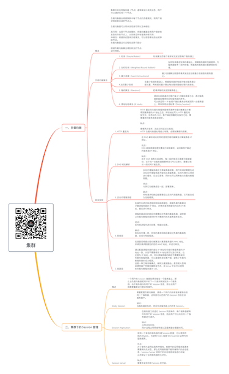

# 集群

关注下方微信公众号，回复【思维导图】即可获得高清原图：

## 一、负载均衡

### 概念

- 集群中的应用服务器（节点）通常被设计成无状态，用户可以请求任何一个节点。

负载均衡器会根据集群中每个节点的负载情况，将用户请求转发到合适的节点上。

负载均衡器可以用来实现高可用以及伸缩性：

高可用：当某个节点故障时，负载均衡器会将用户请求转发到另外的节点上，从而保证所有服务持续可用；
伸缩性：根据系统整体负载情况，可以很容易地添加或移除节点。
负载均衡器运行过程包含两个部分：

根据负载均衡算法得到转发的节点；
进行转发。

### 负载均衡算法

- 1. 轮询（Round Robin）

	- 轮询算法把每个请求轮流发送到每个服务器上

- 2. 加权轮询（Weighted Round Robbin）

	- 加权轮询是在轮询的基础上，根据服务器的性能差异，为服务器赋予一定的权值，性能高的服务器分配更高的权值。

- 3. 最少连接（least Connections）

	- 最少连接算法就是将请求发送给当前最少连接数的服务器上。

- 4.加权最少连接

	- 在最少连接的基础上，根据服务器的性能为每台服务器分配权重，再根据权重计算出每台服务器能处理的连接数。

- 5. 随机算法（Random）

	- 把请求随机发送到服务器上。

- 6. 源地址哈希法 (IP Hash)

	- 源地址哈希通过对客户端 IP 计算哈希值之后，再对服务器数量取模得到目标服务器的序号。
可以保证同一 IP 的客户端的请求会转发到同一台服务器上，用来实现会话粘滞（Sticky Session）

### 转发实现

- 1. HTTP 重定向

	- HTTP 重定向负载均衡服务器使用某种负载均衡算法计算得到服务器的 IP 地址之后，将该地址写入 HTTP 重定向报文中，状态码为 302。客户端收到重定向报文之后，需要重新向服务器发起请求。

缺点：

需要两次请求，因此访问延迟比较高；
HTTP 负载均衡器处理能力有限，会限制集群的规模。

- 2. DNS 域名解析

	- 在 DNS 解析域名的同时使用负载均衡算法计算服务器 IP 地址。

优点：
DNS 能够根据地理位置进行域名解析，返回离用户最近的服务器 IP 地址。

缺点：
由于 DNS 具有多级结构，每一级的域名记录都可能被缓存，当下线一台服务器需要修改 DNS 记录时，需要过很长一段时间才能生效。

- 3. 反向代理服务器

	- 反向代理服务器位于源服务器前面，用户的请求需要先经过反向代理服务器才能到达源服务器。反向代理可以用来进行缓存、日志记录等，同时也可以用来做为负载均衡服务器。

优点：
与其它功能集成在一起，部署简单。

缺点：
所有请求和响应都需要经过反向代理服务器，它可能会成为性能瓶颈。

- 4. 网络层

	- 在操作系统内核进程获取网络数据包，根据负载均衡算法计算源服务器的 IP 地址，并修改请求数据包的目的 IP 地址，最后进行转发。

源服务器返回的响应也需要经过负载均衡服务器，通常是让负载均衡服务器同时作为集群的网关服务器来实现。

优点：
在内核进程中进行处理，性能比较高。

缺点：
和反向代理一样，所有的请求和响应都经过负载均衡服务器，会成为性能瓶颈。

- 5. 链路层

	- 在链路层根据负载均衡算法计算源服务器的 MAC 地址，并修改请求数据包的目的 MAC 地址，并进行转发。

通过配置源服务器的虚拟 IP 地址和负载均衡服务器的 IP 地址一致，从而不需要修改 IP 地址就可以进行转发。也正因为 IP 地址一样，所以源服务器的响应不需要转发回负载均衡服务器，可以直接转发给客户端，避免了负载均衡服务器的成为瓶颈。
这是一种三角传输模式，被称为直接路由。是目前大型网站使用最广负载均衡转发方式，在 Linux 平台可以使用的负载均衡服务器为 LVS。

## 二、集群下的 Session 管理

### 概述

- 一个用户的 Session 信息如果存储在一个服务器上，那么当负载均衡器把用户的下一个请求转发到另一个服务器，由于服务器没有用户的 Session 信息，那么该用户就需要重新进行登录等操作。

### Sticky Session

- 需要配置负载均衡器，使得一个用户的所有请求都路由到同一个服务器，这样就可以把用户的 Session 存放在该服务器中。

缺点：
当服务器宕机时，将丢失该服务器上的所有 Session。

### Session Replication

- 在服务器之间进行 Session 同步操作，每个服务器都有所有用户的 Session 信息，因此用户可以向任何一个服务器进行请求。

缺点：
占用过多内存；
同步过程占用网络带宽以及服务器处理器时间。

### Session Server

- 使用一个单独的服务器存储 Session 数据，可以使用传统的 MySQL，也使用 Redis 或者 Memcached 这种内存型数据库。

优点：
为了使得大型网站具有伸缩性，集群中的应用服务器通常需要保持无状态，那么应用服务器不能存储用户的会话信息。Session Server 将用户的会话信息单独进行存储，从而保证了应用服务器的无状态。

缺点：
需要去实现存取 Session 的代码。

*XMind: ZEN - Trial Version*